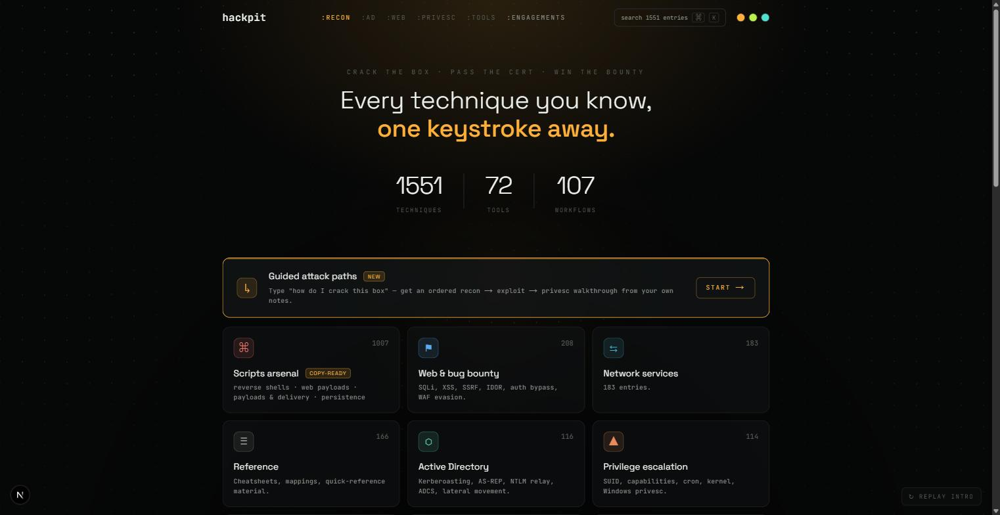
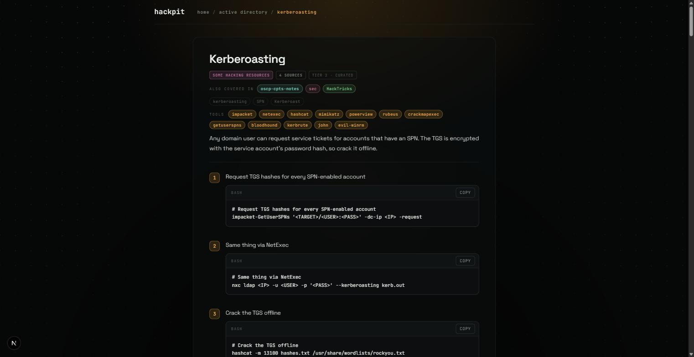
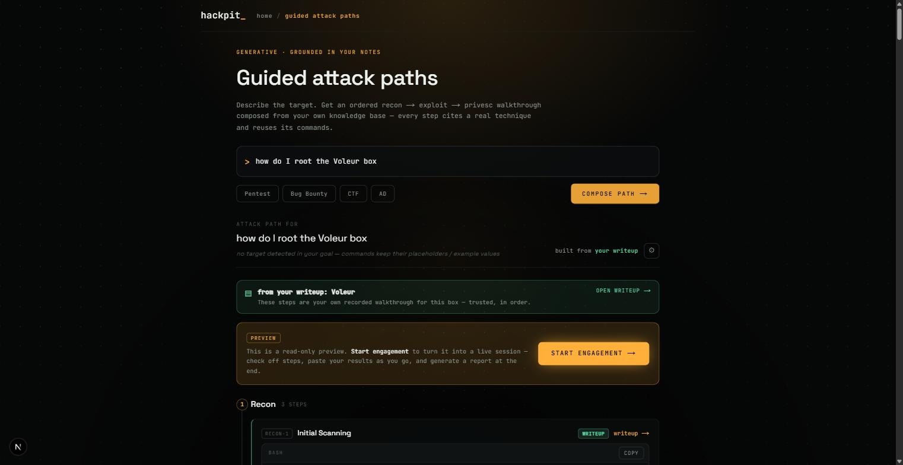
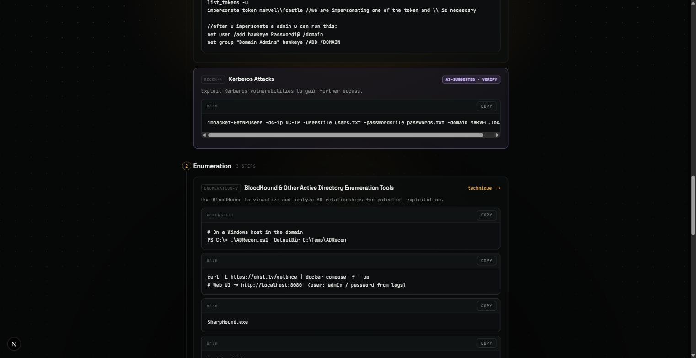
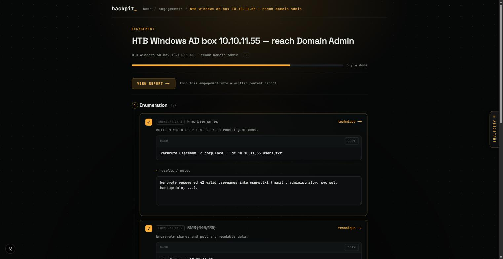
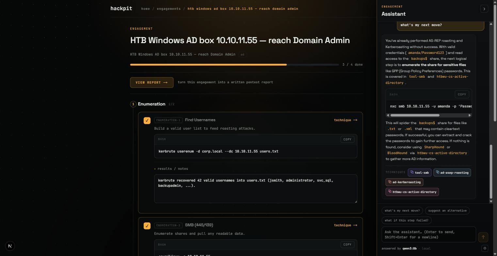
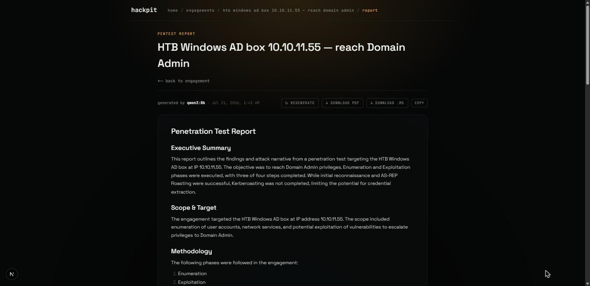
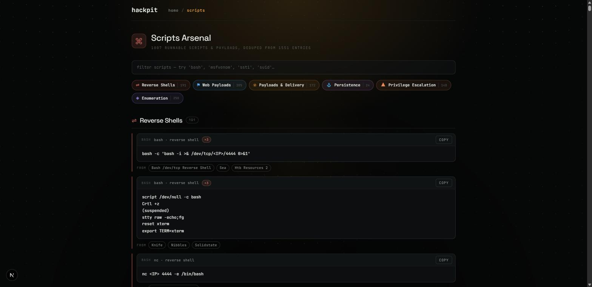
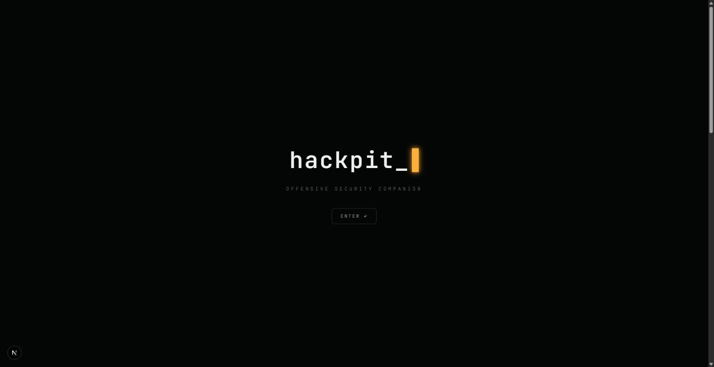

# HackPit

**An AI-powered offensive-security companion — every technique you know, one keystroke away.**

HackPit turns a career's worth of scattered pentest notes into a single, deduplicated, source-attributed knowledge base — then wraps it in an AI companion that searches it, composes guided attack paths from it, runs live engagements against it, and drafts grounded reports from it. It runs **local-first** on your own machine, and every answer cites a real technique from your own library.

<p align="center">
  
</p>

---

## What it is

Offensive-security practitioners accumulate technique notes everywhere: personal course notes, HackTricks, PayloadsAllTheThings, OSCP/CPTS write-ups, box walkthroughs, cheat sheets. Over time it becomes **scattered, duplicated, and impossible to recall mid-engagement** — the exact `impacket-GetUserSPNs` invocation is in one file, the hashcat mode in another, the follow-up in a box write-up you half-remember.

HackPit fixes that. A normalization pipeline folds **15+ sources into one consolidated knowledge base** — 1,551 entries, deduplicated and source-attributed — and a companion UI makes it instantly usable:

- **Recall** any technique with hybrid semantic search (⌘K, anywhere).
- **Plan** with guided attack paths composed from your own tested commands.
- **Execute** engagements as living checklists with pasted evidence that persists.
- **Report** with a grounded pentest write-up drafted from what you actually did.
- **Ask** a session-aware assistant that knows where you are and cites real techniques.

**Who it's for:** pentesters, red teamers, bug bounty hunters, and anyone grinding HTB boxes or OSCP/CPTS/PNPT certs who wants their own knowledge — not a generic chatbot — at their fingertips.

---

## Key features

### Consolidated knowledge base + hybrid semantic search

Every entry is a focused, copy-ready technique with real commands, tool tags, and full source attribution. Where the same technique appeared in multiple sources, they're merged into one entry that shows **how many sources** it was synthesized from and which others **also cover it** — provenance stays traceable without duplicate clutter. Search is **hybrid BM25 + vector**, so `⌘K` finds the right technique by meaning, not just keyword match.

<p align="center">
  
  
</p>

### Guided attack paths — writeup-first, KB-grounded, AI-gap-filled

Describe a target ("how do I root the Voleur box", "compromise an AD domain with creds") and HackPit composes an ordered **recon → enumeration → exploitation → privesc → post-ex** walkthrough. The grounding hierarchy is deliberate:

1. **Your own box write-up first.** If you have a walkthrough for the named box, its steps lead — trusted, in order, marked with a green banner.
2. **KB-grounded next.** Every other step cites a real technique from your library and reuses its exact commands.
3. **AI-suggested gap-fill, clearly marked.** Where the library has a gap, the model may add a step — but it's badged **`AI-SUGGESTED · VERIFY`** so grounded fact is never confused with generation.

Placeholder IPs/hosts in grounded commands are substituted with the target from your goal, so the commands come out ready to run.

<p align="center">
  
  
</p>

### Engagements — checklist + evidence capture + persistence

Turn any attack path into a **live engagement**: check off steps as you complete them, paste tool output and notes inline against each step, and pick up exactly where you left off — progress and evidence persist locally between sessions.

<p align="center">
  
</p>

### Session-aware AI assistant

A drawer that travels with the engagement. Ask "what's my next move?" and it answers **against your actual progress** — it knows which steps you've completed, what evidence you pasted, and which credentials you noted — then grounds its suggestion in specific techniques (cited as chips you can open).

<p align="center">
  
</p>

### Grounded report generation

One click drafts a structured pentest report — executive summary, scope, methodology, and an attack narrative — built **from your checked steps and pasted evidence**, not invented. Export to **Markdown or PDF**, or copy it out.

<p align="center">
  
</p>

### Scripts arsenal

Every runnable script and payload across the whole KB, **extracted, deduped, and grouped by type** (reverse shells, web payloads, delivery, persistence, privesc, enumeration) — each with a reuse count and links back to the entries it came from. The operator's copy-ready view of the entire library.

<p align="center">
  
</p>

### Multi-provider LLM — local-first, key-swappable

HackPit defaults to a **local Ollama** runtime — `qwen3:8b` for composition/chat, `nomic-embed-text` for embeddings, `llava` for note-image captions — so your engagement data never leaves your machine. Prefer a hosted model? Drop a key for OpenAI, Anthropic, Groq, OpenRouter, or xAI and swap providers without touching code.

---

## How it works

```
                    ┌───────────────────────────────────────────────┐
  raw sources  ──▶  │  pipeline/  — ingest · normalize · consolidate  │
  (external,        │  dedupe (alias-key + cosine) · embed (Ollama)   │
   gitignored)      └───────────────────────────────────────────────┘
                                         │  builds
                                         ▼
                    ┌───────────────────────────────────────────────┐
                    │  data/kb/  — one deduplicated, attributed KB    │
                    │  entries.jsonl · embeddings.npy  (gitignored)   │
                    └───────────────────────────────────────────────┘
                                         │  served by
                                         ▼
   FastAPI backend  ──  hybrid BM25 + vector search · attack-path    ──  local Ollama
   (in-memory KB)       composition · engagements · report drafting      (LLM + embeds)
                                         │  HTTP
                                         ▼
   Next.js frontend  ──  search · attack paths · engagements · assistant · reports
```

- **Frontend** — Next.js (App Router) + React + TypeScript + Tailwind. The whole companion UI: command palette, category browser, attack-path composer, engagement runner, assistant drawer, report viewer.
- **Backend** — FastAPI. Loads the consolidated KB into memory once at startup (excluded entries dropped at the door), then serves hybrid search, attack-path composition, engagement persistence, and report generation.
- **Hybrid search** — BM25 lexical ranking fused with vector similarity over local `nomic-embed-text` embeddings. Falls back to pure lexical if the vector half is unavailable, so a query never fails on infrastructure state.
- **Pipeline** — the normalization + consolidation engine that folds each new source into the KB without duplicates (alias-key + cosine matching, structural merge, idempotent re-runs).
- **LLM** — local Ollama by default; multi-provider and key-swappable.

### The grounding philosophy

The core design rule: **answers cite real techniques from the knowledge base, and anything the AI generates beyond the library is clearly marked.** Attack-path steps prefer your own write-ups, then KB-grounded techniques; only when the library has no fit does the model gap-fill, and those steps carry an explicit `AI-SUGGESTED · VERIFY` badge. Whole-box write-ups and broad index/grab-bag pages are kept out of the grounding pool so a step is always a focused technique — never a wall of unrelated content. The result is a companion you can trust: grounded fact and generation are never blurred together.

---

## Knowledge base

The KB is the heart of HackPit: **1,551 entries synthesized from 15+ sources** into one deduplicated, source-attributed library spanning 33 categories — web & bug bounty, Active Directory, network services, privilege escalation, reference, and more.

The consolidation pipeline:

1. **Ingest** each source in its native shape (Markdown notes, exported cheat sheets, structured course notes, box write-ups, PDFs).
2. **Normalize** to one canonical entry schema — title, summary, tested commands, tool tags, category, tier.
3. **Consolidate** by folding each new source into the existing KB: an alias-keyed canonical class plus cosine similarity find the right merge target, content is structurally merged (never blindly concatenated), and provenance from every contributing source is recorded. Re-runs are idempotent.
4. **Embed** every entry with a local model to power the vector half of search.
5. **Attribute** — each entry records which sources it was built from; the richest home wins as the spine, and the rest surface as "also covered in" chips.

> **On third-party sources.** HackPit's knowledge base is **adapted and synthesized** from a mix of the author's own notes and public community resources (e.g. HackTricks, PayloadsAllTheThings, and others — some used with permission and attributed). Those raw sources are **not redistributed**: they are ingested locally into a private index, and both the raw source trees and the built KB are **gitignored and never committed**. **This repository ships code only** — the engine that builds and serves a knowledge base, not anyone else's content.

---

## Tech stack

| Layer | Stack |
|---|---|
| **Frontend** | Next.js 16 (App Router), React 19, TypeScript 5, Tailwind CSS v4 |
| **Backend** | FastAPI, Uvicorn, NumPy, Python 3.14 |
| **Search** | Hybrid BM25 (lexical) + vector (cosine over local embeddings) |
| **LLM (local)** | Ollama — `qwen3:8b` (compose/chat), `nomic-embed-text` (embeddings), `llava` (image captions) |
| **LLM (optional)** | OpenAI · Anthropic · Groq · OpenRouter · xAI (key-swappable) |
| **Pipeline** | Python — ingest, normalize, consolidate (dedupe), embed |

---

## Running it

**Prerequisites:** [Ollama](https://ollama.com) running locally, Python 3.14+, and Node 18+.

```bash
# 1. Local models (one-time)
ollama pull qwen3:8b
ollama pull nomic-embed-text

# 2. Config
cp .env.example .env      # set OLLAMA_BASE_URL (and any provider keys you want)

# 3. Backend  (serves the KB + search + attack paths on :8000)
cd backend
uv run uvicorn main:app --reload

# 4. Frontend (the companion UI on :3000)
cd frontend
npm install
npm run dev
```

Then open **http://localhost:3000**.

> The consolidated knowledge base (`data/`) is built by the `pipeline/` from external source trees and is gitignored. Point `HACKPIT_SOURCES_ROOT` at your own sources and run the pipeline to build your KB, or wire the backend to your own `entries.jsonl`.

---

## Project structure

```
HackPit/
├── frontend/    Next.js companion UI (search, attack paths, engagements, reports)
├── backend/     FastAPI service — in-memory KB, hybrid search, composition, reports
├── pipeline/    ingest → normalize → consolidate → embed  (the KB build engine)
├── docs/        design notes
├── data/        built KB + embeddings            (gitignored — never committed)
├── sources/     raw external source trees        (gitignored — never committed)
└── assets/      screenshots for this README
```

---

## A note on this project

HackPit is a **personal portfolio project** — built to explore what a genuinely useful, grounded AI companion for offensive security looks like when it's anchored to a real, curated knowledge base instead of open-ended generation. It reflects choices I care about: local-first so sensitive engagement data stays on your machine, honest provenance so you always know where an answer came from, and a hard line between grounded fact and AI suggestion.

**License / use.** For authorized security testing and educational use only.

<p align="center">
  
</p>

<p align="center"><sub>Every technique you know, one keystroke away.</sub></p>
