<!-- logo -->
<!-- ▶ DEMO VIDEO — Zaid: drop the demo video / GIF embed here -->

<h1 align="center">HackPit</h1>

<p align="center">
  <em>Another AI that hacks?</em> Sort of. This one reads a career's worth of <strong>your own</strong> pentest notes,
  plans the whole engagement, and drives real Kali tooling —<br>
  and it never fires a single command you didn't approve.
</p>

<p align="center">
  <a href="https://github.com/Zaidzyy/HackPit/actions/workflows/ci.yml"></a>
  <a href="LICENSE"></a>
  
  
  
  
  
  
  
  
  
</p>

HackPit is an **AI-driven offensive-security companion with a gated execution cockpit**. It started as one thing — turn a scattered pile of pentest notes into a single searchable knowledge base — and grew into a second: a Kali cockpit where the AI plans the attack and you approve every command it runs.

Two ideas make it different from "an LLM that hacks":

- **Grounded, not generated.** Every answer cites a real technique from *your* library. Commands come from the knowledge base, never invented by the model — and anything the AI does add is clearly badged `AI-SUGGESTED · VERIFY`.
- **Proposes, never fires.** The agent plans the whole kill-chain, but a human approves each command individually. There is no autonomous mode — and that's a deliberate design choice, enforced in code, not a missing feature.

It runs **local-first** — the knowledge base, hybrid search, and every execution surface stay on your machine. The default AI composer is the **Claude Agent SDK (Opus)**, driven through your local Claude Code login with no API key; switch to local **Ollama** any time you want a fully-offline setup where nothing leaves at all.

<p align="center">
  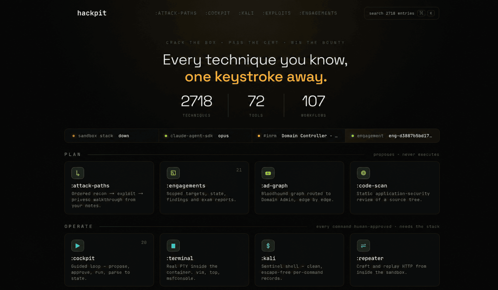
</p>

> ### ⚠️ Authorized use only
> The cockpit runs **real offensive tools against real hosts** — with C2, evasion tooling, and a live Windows/AD path. Use it only where you're authorized: your own lab, an HTB/PG box, or a client with a signed scope. Every command is gated on your explicit approval, and in engagement mode on a target you declared in scope. **Engagement mode has no network containment** — human approval is the only thing standing between a command and the internet. Read the [Safety model](#-safety-model); it's the core of the design, not a footnote.

> ### 📦 This public repo ships code only
> The knowledge sources the KB is built from — course notes, write-ups, cloned repos, PDFs, cheat sheets — are kept **local and git-ignored, never committed**. What *is* committed: the pipeline that builds the KB, plus per-source **manifests** (`sources/*-manifest.md`) recording each source's URL · date · commit SHA · verdict. The built KB itself (`data/`) is generated locally — **a fresh clone starts with an empty knowledge base until you build one or get it from the author.**

---

## What you get, at a glance

| | |
|---|---|
| 🔎 **Knowledge base + hybrid search** | 2,747 deduped, source-attributed techniques across 33 categories. `⌘K` finds them by meaning. |
| 🧭 **Guided attack paths** | Recon → privesc walkthroughs, write-up-first, KB-grounded, AI gap-fill clearly marked. |
| 🎯 **Gated cockpit** | Real Kali execution, one approved command at a time, behind four ordered gates. |
| ▤ **Interactive persistent sessions** | Named, parallel **tmux** sessions in the open box with per-session cwd — **automatic prompt detection** flips a session to *"interactive — send input"* when `msfconsole` / `sliver-client` / `evil-winrm` / a REPL is waiting, long scans **auto-background at 60s** with a notify-once completion, and wedge / pipe-degradation recovery. **Input stays human-only, every line.** |
| ◈ **Guided recon** | Scoped domain → recon as approved jobs → ranked attack surface; discoveries can only widen the set *within* scope. |
| 🕸️ **Web app testing** | Recording proxy, repeater, intruder, GraphQL, browser interception, OOB callbacks. |
| 🎟️ **Token workbench** | Decode / analyze / tamper **JWT**, **OAuth/OIDC** and **SAML** — alg-none, RS→HS confusion, kid/jku/jwk injection, redirect_uri & PKCE-downgrade builders, XSW1–8 — then send the mutated token through the repeater. The weak-secret crack is one gated job. |
| ⇶ **Single-packet race** | Fire one request **N times so the copies arrive in the same instant** — HTTP/2 single-packet or HTTP/1.1 last-byte sync — to beat a check-then-act window (limit overrun, TOCTOU, coupon reuse, one-time-token replay). One approval buys the batch; the verdict is **"K of N won the race"** and a confirmed race becomes a High finding. |
| ⇋ **Request smuggling / desync** | Probe a front-end/back-end pair for **CL.TE / TE.CL / CL.CL / TE.TE / CL.0** and the HTTP/2-downgrade **H2.CL / H2.TE / H2.0** variants. **Detection is safe-by-default** (timing-differential — hangs a back-end on its own probe, touches no other user); **confirmation** (socket poisoning) is a **separate approve-each with a co-tenant warning**. A per-mutation verdict matrix; a hit becomes a High/Critical finding. |
| 🗄️ **Web cache poisoning / deception** | Probe a shared cache for **unkeyed inputs** (`X-Forwarded-Host` & friends, cloaked params, fat-GET body) reflected into a **cacheable** response, plus **cache deception** (a dynamic page cached under a `/…/foo.css` path). **Detection is safe-by-default** (reflection + cacheability — plants nothing); **confirmation** (poison-plant) is a **separate approve-each with a co-user warning**. A per-input verdict table; a hit becomes a High/Critical finding. |
| ◎ **Nuclei template scan** | Scoped target(s) → templates → severity-ranked findings, one approval; results flow into engagement state. |
| 🪟 **Windows / AD** | BloodHound graph → route to Domain Admin → walk it live over WinRM. |
| 📄 **AD CS (ESC1–8)** | `certipy find` → certtemplate/certauthority nodes + synthesized `ESC1…ESC8` edges → a low-priv enrollee → vulnerable template → Domain Admin, routed in the same graph; the agent picks an edge, you approve every command. |
| 🎫 **Unconstrained delegation + tickets** | `unconstraineddelegation` → a routable `TrustedForDelegation` edge (own the host, coerce a DC, capture its TGT, DCSync) → Domain Admin; **golden / silver ticket forging** as propose-only persistence, offered only once you hold the secret and never a step on the route. |
| ☁️ **Cloud IAM privesc** | ScoutSuite/Prowler/pacu/cloudfox → typed IAM graph → route to an admin/owner identity across AWS/Azure/GCP; the agent picks an edge, you approve every command. |
| 🌉 **Web SSRF → cloud creds** | A captured IMDS response (from the repeater, a nuclei hit, or an OOB callback) → an **owned** cloud principal seeded into the IAM graph → the privesc walk starts from the identity you just stole. |
| ⛓️ **Cross-domain kill-chain** | The capstone: **three swim-lanes** (web → cloud → on-prem AD) stitched into one routed chain by the cross-domain seams (SSRF→cloud metadata, cloud secret→AD credential, web RCE→host). The agent picks an edge, never a command — a seam crossing runs through the gated executor, a within-lane hop in its own `:cloud`/`:ad-graph` view. |
| 🔑 **Credential attack** | Spray captured/OSINT creds, crack captured hashes — one approval per job; secrets stay in loot files, a hit lights the AD graph. |
| 📡 **C2 & tunnels** | Sliver implants, DNS tunnels, pivots, a public redirector — all gated. |
| 🛡️ **Purple-team view** | The defender's-eye footprint of every command, with an honest OPSEC channel. |
| 📝 **Grounded reports** | OSCP/CPTS/H1 templates, evidence spliced from real state, CVSS computed not asserted. |
| 🧰 **Arsenal · exploits · SAST** | 161-tool catalog, a 47k-exploit CVE index, and an 8-language code scanner. |
| 🧩 **Binary/RE, pwn & forensics** | Ghidra / radare2 / gdb / pwntools / ROPgadget / ropper / one_gadget / angr / pwninit / checksec / patchelf for reversing & exploit-dev, plus volatility3 / binwalk / foremost / steghide / zsteg / stegseek / exiftool / bulk_extractor for forensics & CTF — proposable templates over `<binary>`/`<file>`, gated approve-each like every tool (no auto-exec). |
| 🔬 **AI code-audit fan-out** | Point it at a repo → an agent maps the entrypoints & flows **once**, then verifies **one flow per agent** against source → deduped, severity-ranked findings, each with an attacker path + a propose-only PoC. `patched-since` audits only a git diff; one approved job, no new gate. |
| ⛓️ **Web3 / smart-contract audit** | Three built-in playbooks on the same fan-out: **EVM external-flow** (reentrancy / access-control / oracle-manipulation / loss-of-funds), **Cosmos ABCI panic-halt** (four panic classes → consensus halt), **Anchor account-model** (missing-owner / signer-spoof / CPI-confusion / overflow). KB-grounded, chain/contract/function-tagged; an approve-each **slither / mythril / echidna** tool pass. |
| ▣ **Finding pipeline** | Every producer emits one **structured schema** (attacker-path, source-refs, CVSS, custom fields) → duplicates **auto-merge** idempotently → a **pluggable severity ranker** (bug-bounty payout vs compliance) rescores per engagement → **post-scripts** validate / draft a report (in-process) or build a PoC (approve-each). Pure data; no new gate. |
| ⧉ **Workflow builder** | Compose your own **reusable prompt-step playbooks** over the code-audit fan-out: each step is a focused prompt with **variables** (`{{repo}}`, dotted `{{steps.…output}}`, per-run extras), an output schema, and a **batch / depth / siblings** fan-out shape. Export / import them as portable JSON — imported ones are **inspected before they ever run** — and two proven built-ins ship visible on first load. Authoring executes nothing; a run is the audit's one approved job, no new gate. |
| ⚖️ **Engagement governance** | Before an engagement goes live, draft + approve a formal **RoE / ConOps / Deconfliction / OPPLAN** package: objectives carry a status **state machine** + **MITRE ATT&CK** ids + OPSEC level, an objectives board + coverage matrix render it, and it flows into the report. The RoE **formalises** the scope handrail — advisory, not a machine veto; per-command human approval stays the bound. Generation is propose-only; no new gate. |
| 🔌 **MCP server** | 15 read-only tools so another AI agent can *see* your engagement — eyes, not hands. |

---

## 🧠 The companion

### Consolidated knowledge base + hybrid search

Every entry is a focused, copy-ready technique with real commands, tool tags, and full source attribution. The same technique from several sources is merged into **one** entry that shows how many sources it came from and which others also cover it — provenance without the clutter. Search is **hybrid BM25 + vector**, so `⌘K` finds the right thing by meaning, not exact words.

<p align="center">
  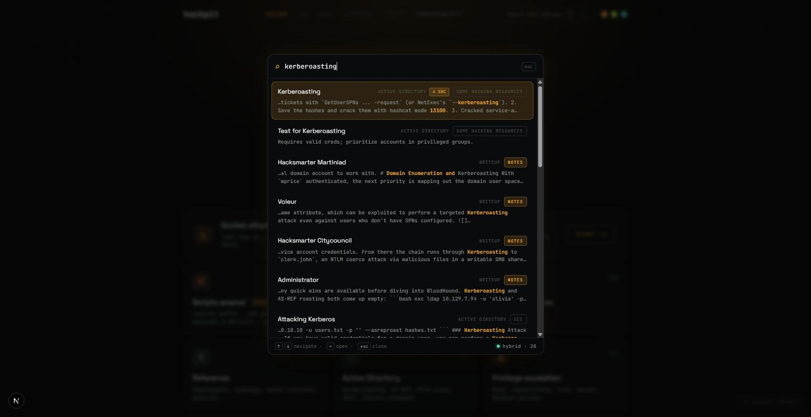
  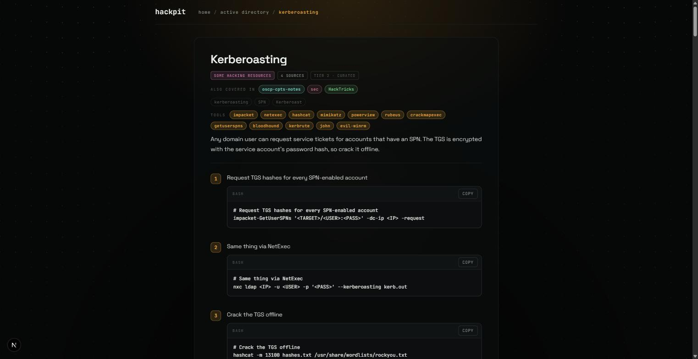
</p>

Some entries are **your own** — original methodology you wrote, badged `HACKPIT-AUTHORED` and treated as tier-1 "your notes."

<p align="center">
  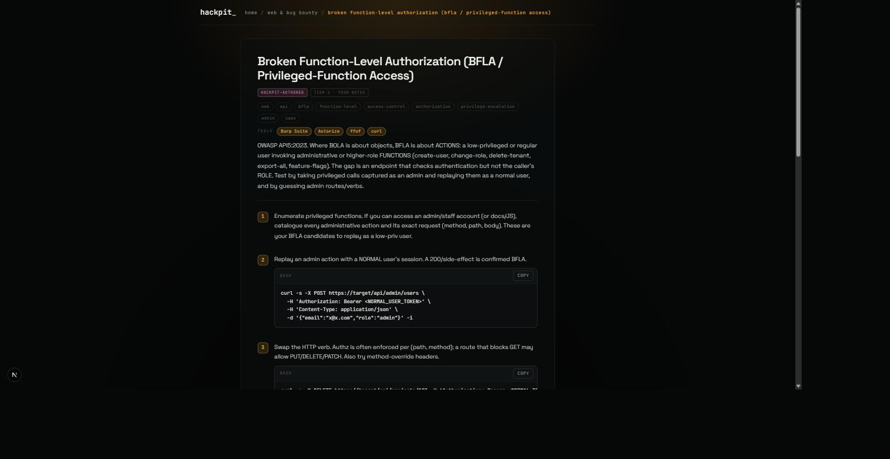
</p>

### Guided attack paths

Describe a target and HackPit composes an ordered **recon → enumeration → exploitation → privesc → post-ex** plan. The grounding order is deliberate: your own box **write-up first**, then **KB-grounded** steps that reuse exact commands, and only where the library has a gap does the model add an **`AI-SUGGESTED · VERIFY`** step. A target-profiler reads your goal and scope so a WordPress blog and a multi-tenant SaaS get different playbooks; pivotal steps carry *if it works →* / *if blocked →* branches, and any out-of-scope host you paste is dropped.

<p align="center">
  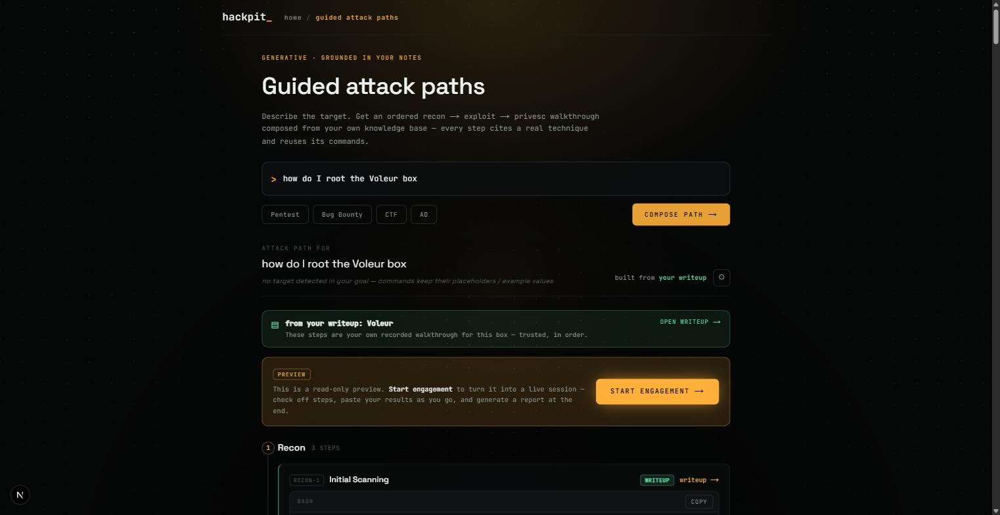
  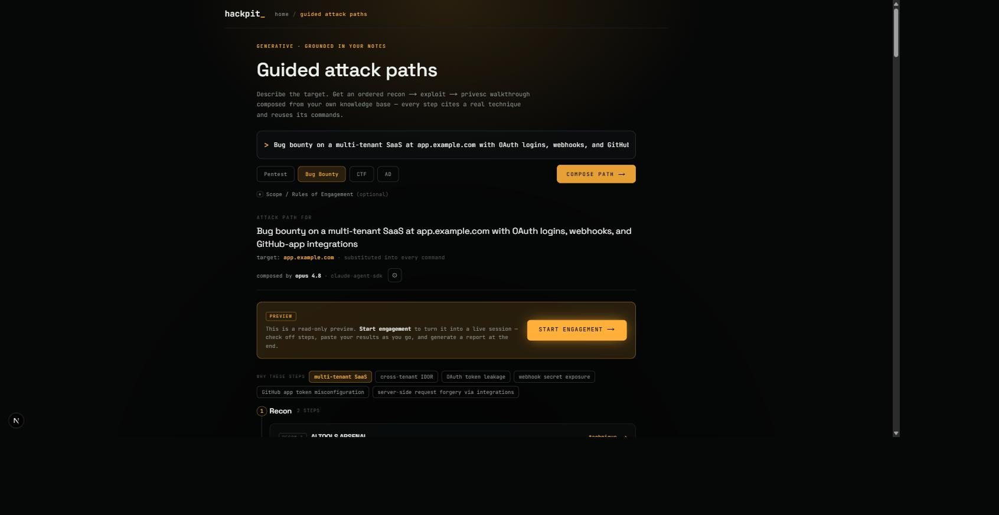
</p>

### Engagements, assistant & grounded reports

Turn a path into a **living engagement** — checked steps, pasted evidence, captured hosts/creds/findings that persist. A **session-aware assistant** answers against your actual progress and cites real techniques. One click drafts a **grounded report** (exec summary, scope, methodology, attack narrative) built from your evidence — with OSCP-style proof tables and **CVSS 3.1 computed, not asserted**.

Every saved path lives in one place, with its own progress and evidence tracked locally:

<p align="center">
  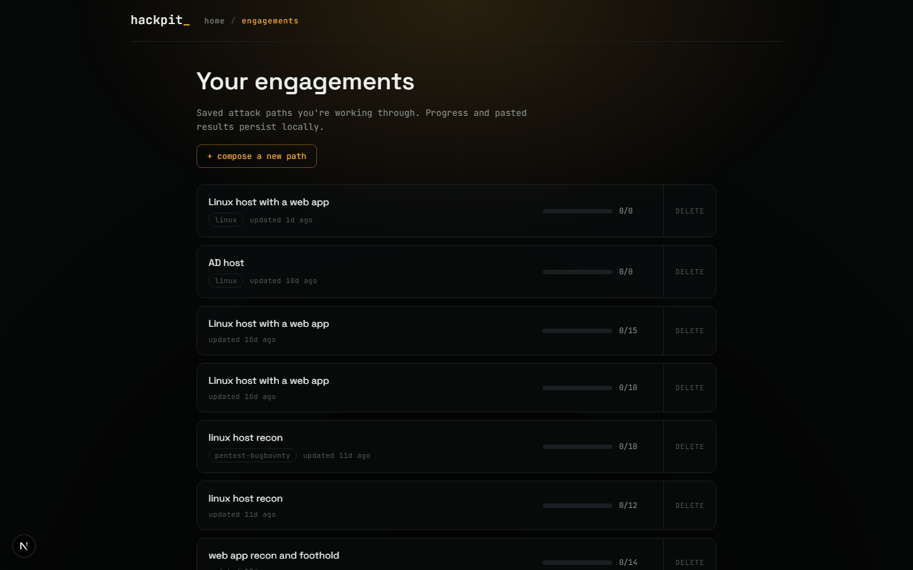
</p>

Open one and it's a working engagement; finish it and the report writes itself from what you actually did:

<p align="center">
  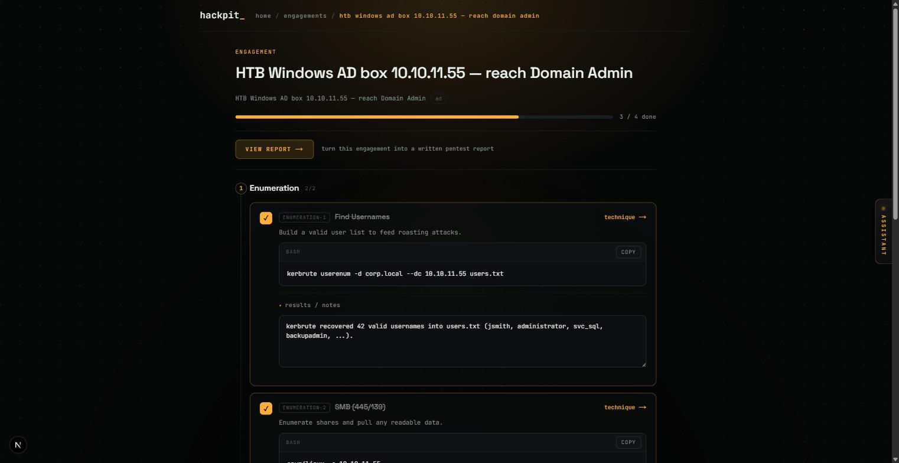
  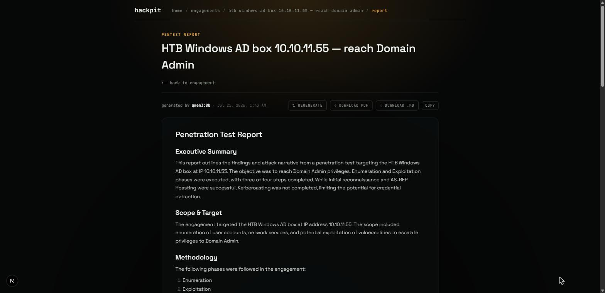
</p>
<p align="center">
  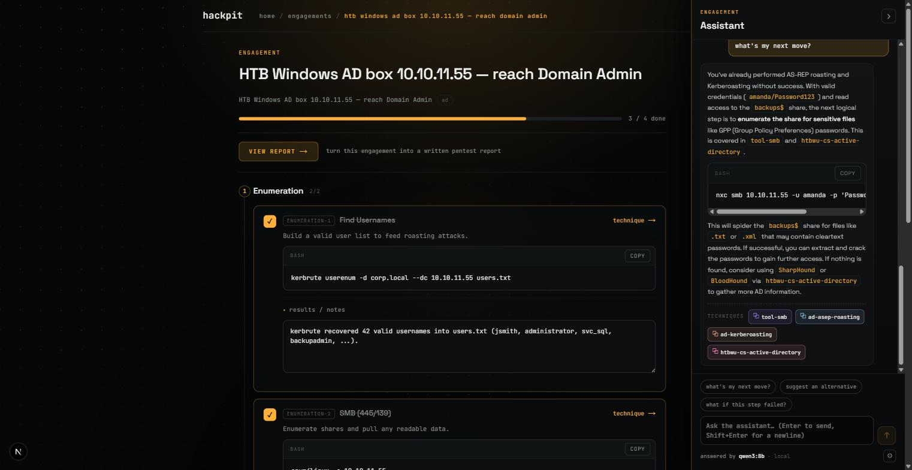
  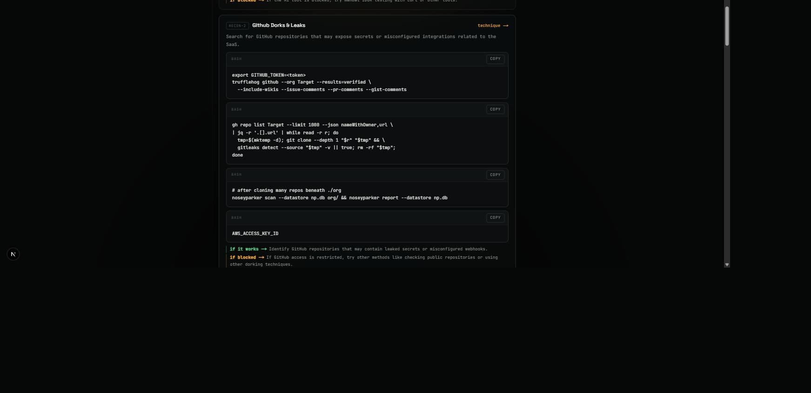
</p>

### ⚖️ Engagement governance — RoE / ConOps / Deconfliction / OPPLAN

The most on-brand addition: it turns *"human approves each command"* into *"human approves each command **inside a written, agreed operating frame**."* Before an engagement goes live, the operator drafts (LLM-assisted, **propose-only**) and approves four governance documents — **Rules of Engagement**, **Concept of Operations**, a **Deconfliction Plan** (how your traffic is told apart from a real incident), and an **OPPLAN**: a list of **objectives**, each with a status **state machine** (`pending → in-progress → completed / blocked / cancelled`, with `completed`/`cancelled` terminal), one or more **MITRE ATT&CK** technique ids, an OPSEC level and an optional C2 tier. Objectives drive the orchestrator's targeting — the proposer aims *toward an active objective*, each step still human-approved, and an approved exit-0 run records itself as the objective's advance evidence. A **MITRE ATT&CK coverage matrix** shows which tactics/techniques the engagement exercised, and the whole package flows into the report.

The RoE **formalises** the scope handrail — it references the same scope model, and an out-of-RoE scope is **flagged in the UI, not machine-blocked**. It is advisory to the human; per-command approval stays the actual bound, and governance **executes nothing and adds no gate**. Ported from [Decepticon](https://github.com/vitalii-honchar/decepticon) (Apache-2.0 — see [`NOTICE`](NOTICE) / [`THIRD_PARTY_LICENSES`](THIRD_PARTY_LICENSES)).

<p align="center">
  
</p>

<p align="center">
  
</p>

### Scripts arsenal

Every runnable script and payload across the whole KB — **extracted, deduped, and grouped by type** (reverse shells, web payloads, delivery, persistence, privesc, enumeration), each with a reuse count and links back to its entries.

<p align="center">
  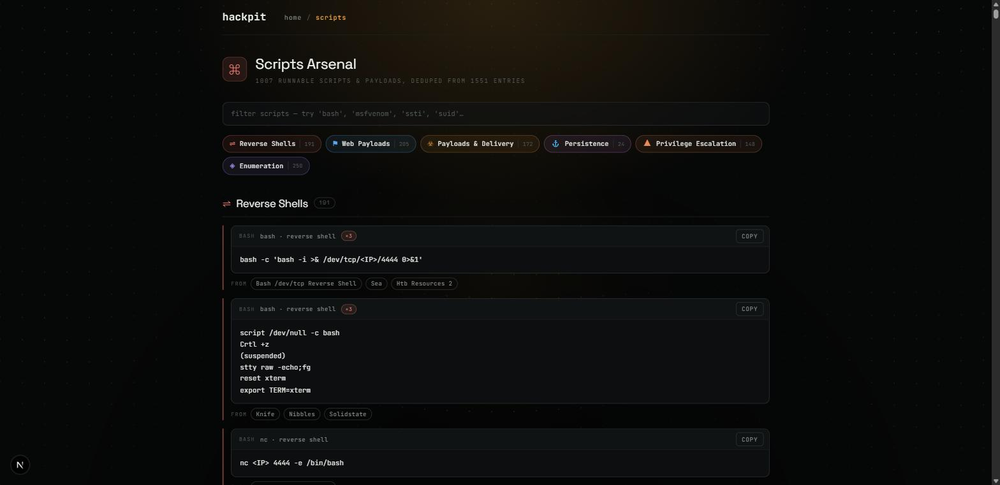
</p>

---

## 🎯 The cockpit — gated execution

A Kali container driven from the UI, **one approved command at a time**. From here the AI plans a path, then you walk it — in an isolated lab, against a scoped real target, or on a Windows box over WinRM.

<p align="center">
  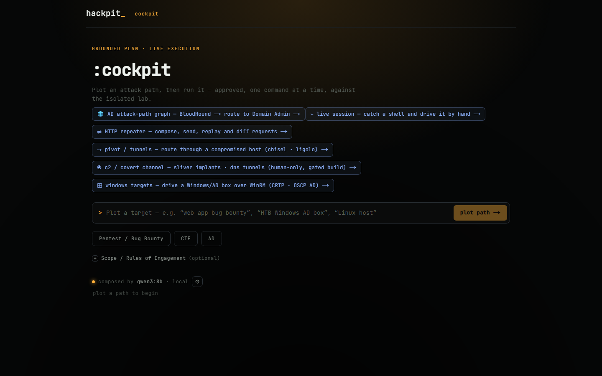
</p>

### `:kali` and `:terminal` — three shells, on purpose

`:kali` is a persistent shell that logs a clean, per-command transcript (what your reports are built from). `:terminal` adds two more surfaces onto the same open box: a **real PTY** (so `top`, `vim`, a curses tool render), and **named persistent sessions** — the headline. Each named session is an independent, parallel **tmux** session with its own cwd/env that survive across calls, and the engine does **automatic interactive-prompt detection**: when `msfconsole` (`msf6 >`), `sliver-client`, `evil-winrm`, or a REPL stops and waits, the UI raises **"interactive — send input"** and *you* type the next line. Long scans run **`background=True`** (or auto-background after 60s) with a completion that notifies exactly once; a wedged session or a degraded tmux `pipe-pane` is diagnosed with a recovery ladder. All three are human-driven — typing *is* the approval, **every line** — and fully audited. The session engine is ported from **Decepticon**'s `tools/bash` (Apache-2.0); its *mechanics* only — the **`is_input` autonomy is deliberately not adopted**, so the orchestrator can never drive a live prompt.

<p align="center">
  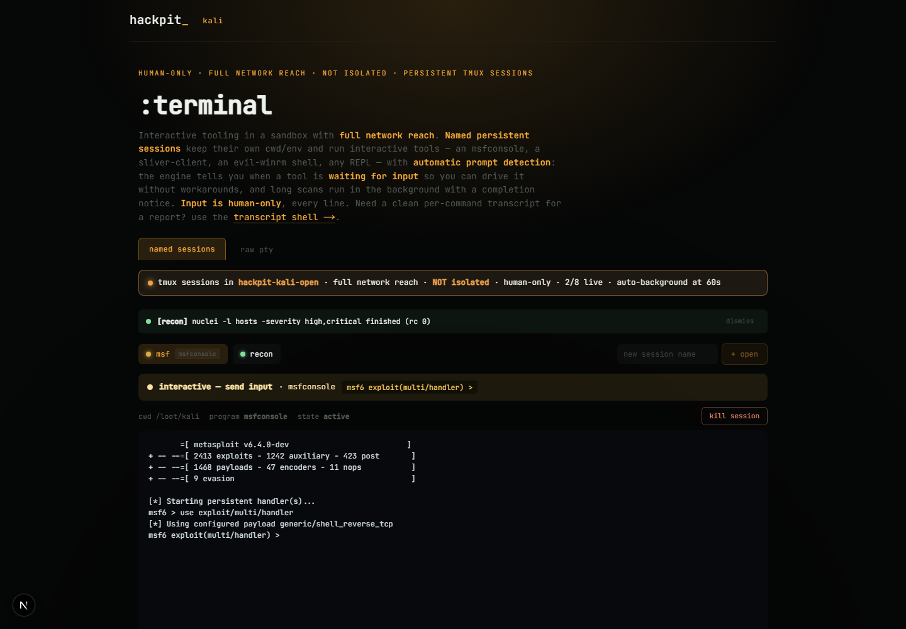
</p>

### Web application testing

A full web surface behind the same gates: a **recording proxy** that captures traffic, an **HTTP repeater** to compose/send/replay/diff requests, an **intruder** for fuzzing (one approval can buy many requests, so it's flagged as such), **browser interception** that publishes the proxy to a real Chrome for sites that refuse a bare toolchain, and end-to-end **GraphQL** support — engine fingerprinting, field-suggestion enumeration, and a repeater round-trip where your raw body wins.

<p align="center">
  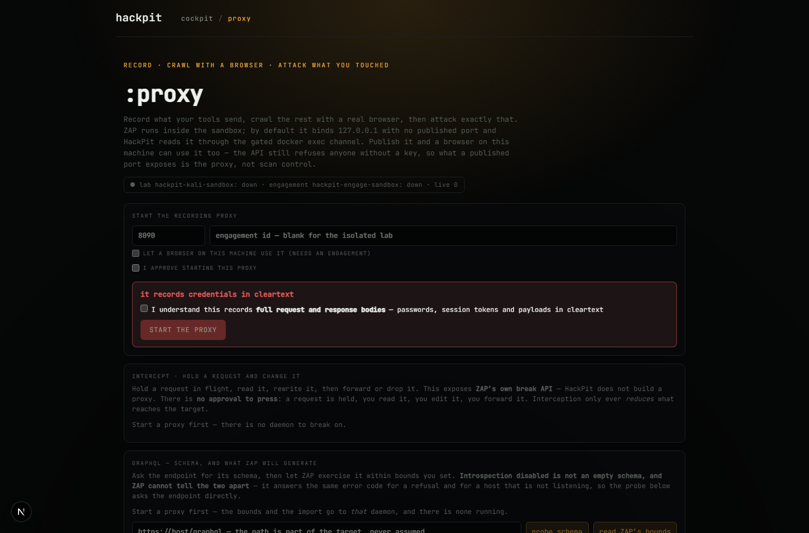
  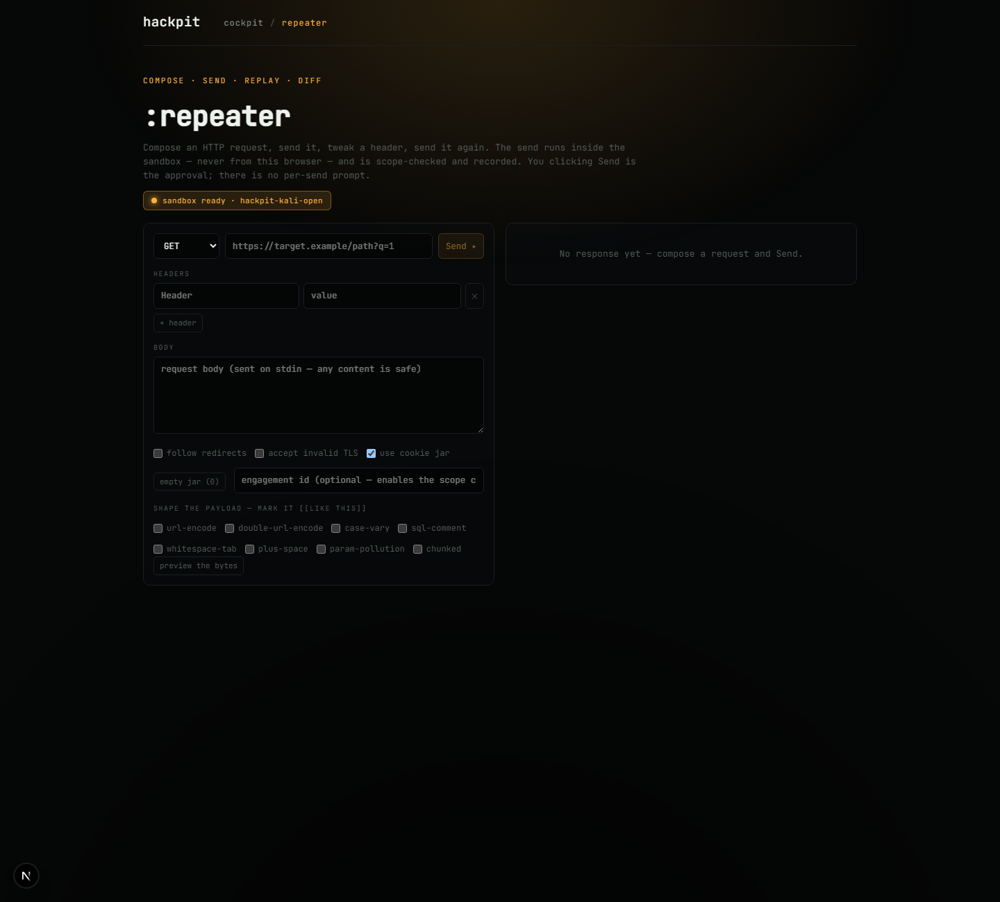
</p>
<p align="center">
  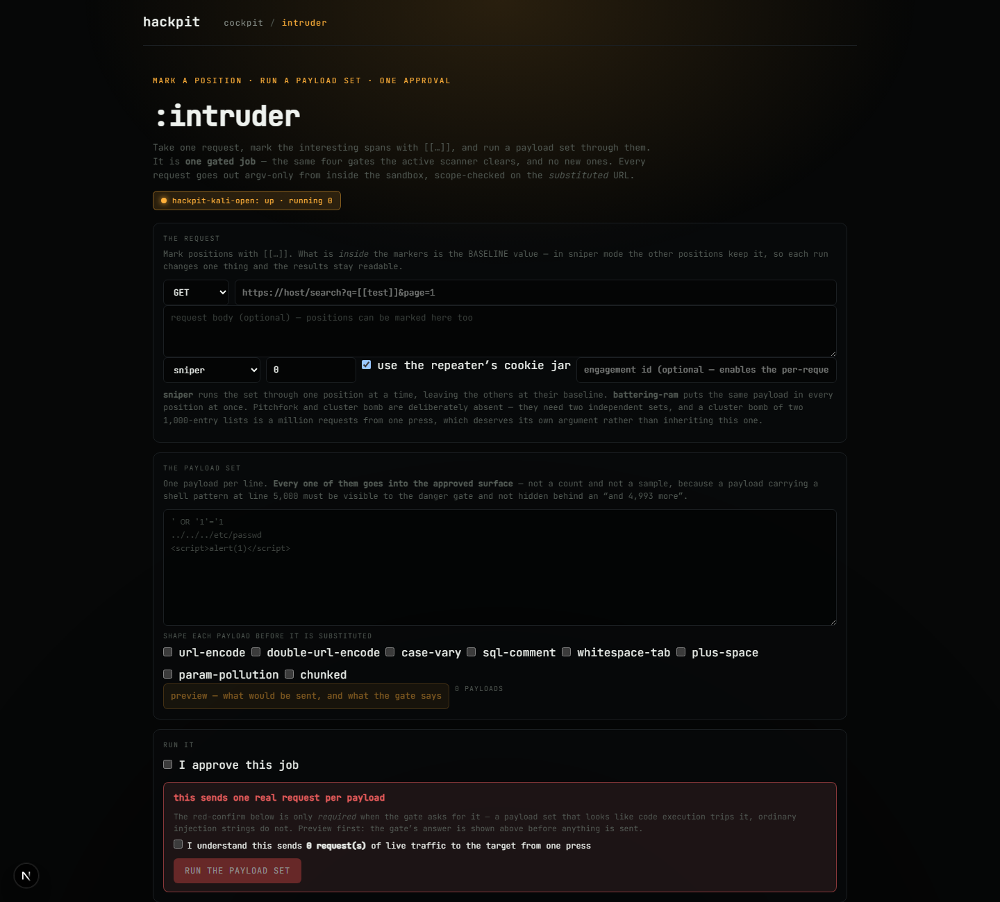
  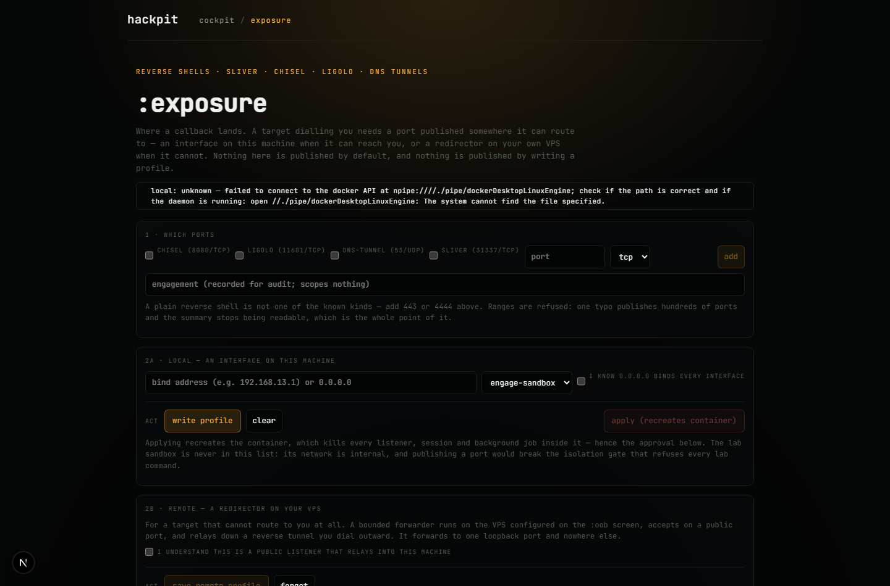
</p>

### Token workbench — JWT / OAuth / OIDC / SAML

The token equivalent of the GraphQL panel, and it takes the same shape: a **pure** analysis/tamper core that recognises tokens **by shape, not path**, hands values back only where *you* typed them, and **sends nothing** — a mutated token goes to a real endpoint only through the human-approved, scope-checked **repeater**. Paste a **JWT** and it decodes header, claims and signature and flags the classic misconfigurations (`alg=none` accepted, missing `exp`, a crackable HMAC secret, an injectable `kid`/`jku`/`jwk`/`x5u`); pick a tamper and it produces the token to send — **`alg=none`** (with the case variants `none`/`None`/`nOnE` that catch a case-blind check), **RS256→HS256 confusion** signed with the server's public key as the HMAC secret, **`kid` injection** (path-traversal / SQLi / command), **`jwk`/`jku`/`x5u` header injection**, and **edit-any-claim then re-sign**. For **OAuth/OIDC**, parse an authorization request or callback and build the attacks — `redirect_uri` bypasses (reusing the open-redirect table), `state` drop (CSRF), **PKCE downgrade**, forced `response_mode`, implicit-flow leak. For **SAML**, parse a Response (base64, or base64+deflate, or raw XML), locate whether the assertion vs the response is signed, and emit **XML Signature Wrapping (XSW1–8)**, signature stripping, comment-injection and unsigned-assertion variants.

A token HackPit spots in **captured traffic** is modelled **names/claims-only** — never a claim value or signature, because a JWT claim is routinely a secret — exactly the rule the GraphQL argument model follows. The one thing that runs, the **weak-secret crack** (`hashcat -m 16500` over a wordlist), is **one gated job** behind the same four gates: the token goes to a loot file (never the argv), a recovered secret goes to loot (never the finding) and lands a high finding, and the stop is ungated. **No new gate** anywhere — per-command human approval is the only bound. Available as a dedicated **`/tokens`** surface and mounted inside **`:proxy`**.

<p align="center">
  
</p>

> The screenshot uses a **synthetic, self-signed demo JWT** (`/tokens?demo=1`) — never a real user's token. A real captured token pastes into the same box; the mutated result copies straight into the repeater to send.

### Single-packet race tester — the primitive the intruder can't do

The intruder's serial loop sends one request, then the next — so a target's *check-then-act* window closes between them and a race never fires. **`:race`** is the missing primitive: it takes **one** request and fires it **N times so the copies arrive in the same instant**, to hit limit-overrun / TOCTOU / coupon-reuse / one-time-token races. Two transports the operator picks: **HTTP/2 single-packet** — one connection, N requests queued with the **final frame withheld**, then every final frame **released together** so all N complete in a single packet (PortSwigger's technique, the reliable modern mode) — and **HTTP/1.1 last-byte sync** — N connections, every byte but the last sent, then the last byte **released on all at once**. The engine is a small in-repo client baked into the sandbox (`race-singlepacket`), invoked **argv-only with the whole request delivered on stdin** — no shell parses a request byte.

It is modelled **exactly on the intruder**: **one gated job**, the **same four gates** and no new ones, run inside the hardcoded open sandbox, **scope-checked on the wire** (an out-of-scope host refuses the whole batch, nothing sent), with an **ungated stop**. The whole request template *and* the concurrency count N are in the approved surface — the intruder's completeness rule, so a body carrying a shell pattern reaches the danger gate rather than hiding behind a count. The verdict is the race-window signal, not a raw dump: the N responses are clustered, and when the **rare** outcome a serial baseline returns *once* (the single "coupon applied") appears **more than once**, that is a race — reported as **"K of N requests won the race"**, and a confirmed race lands a **High finding** in engagement state. Available as a dedicated **`/race`** surface next to `:intruder`.

### Request smuggling / desync — safe detection, gated confirmation

Request smuggling is the other front-end/back-end parsing bug: when the edge and the origin disagree on where a request ends, bytes from one request prefix the next — used to bypass front-end access control, poison the response queue or cache, or capture another user's request. **`:smuggle`** probes a target for the whole family — **CL.TE, TE.CL, CL.CL, TE.TE, CL.0** and the modern HTTP/2-downgrade **H2.CL, H2.TE, H2.0** variants — and it is built around one rule the class demands: **detection is safe, confirmation is not, so they are split.**

**Detection is the default and it is self-contained.** For each chosen mutation it sends a request whose ambiguous framing makes a *back-end* wait for body bytes that never arrive; if a front-end/back-end pair disagree the probe hangs (a large timing delta over a normal baseline), and if a single RFC-consistent server handles it the probe returns immediately. **No other user's request is touched** — the delay is the whole signal. The screen renders a **per-mutation verdict matrix** (baseline vs probe vs Δ, susceptible / clear / inconclusive); a susceptible mutation lands a **High finding**.

**Confirmation is a separate approve-each with a co-tenant warning.** Socket-poisoning confirmation smuggles a partial request onto a shared connection then sends a normal one to observe the poisoned response — *this can affect the next request on that connection, possibly another user's*. So it is its own explicit approval carrying a plain-language co-tenant warning, one susceptible mutation at a time; a confirmed desync lands a **Critical finding**. It is still just approve-each — the **same four gates** the intruder/race clear, **no new gate class**. The engine is a small in-repo client baked into the sandbox (`smuggle-probe`), invoked **argv-only with the whole request delivered on stdin**; the standard external tools **`smuggler.py`** (defparam) and **`h2csmuggler`** (BishopFox) ship alongside for manual use. Scope-checked on the wire, ungated stop. Available as a dedicated **`/smuggle`** surface next to `:race`.

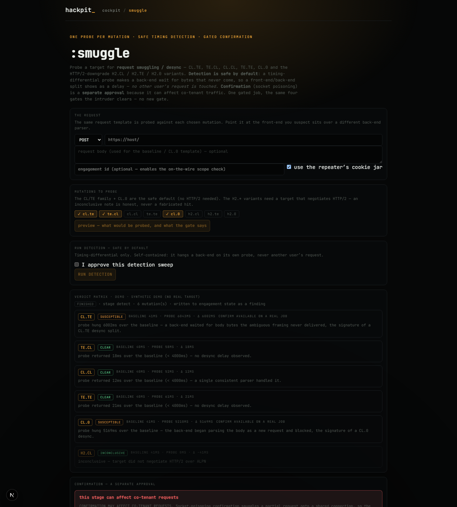

<p align="center">
  
</p>

> The screenshot uses a **synthetic demo result set** — a coupon-redeem endpoint where 3 of 20 single-packet requests beat the "already used" check — never a real target. A real job pastes the one-time request into the same box and fires it under one approval.

### Web cache poisoning / deception — safe detection, gated poison-plant

A shared cache trusts the origin's response and serves it to everyone who shares a cache key. **Web cache poisoning** turns that into an attack: send data in an **unkeyed input** — a header the cache omits from its key (`X-Forwarded-Host`, `X-Forwarded-Scheme`, `X-Host`, `X-Original-URL`, …), a **cloaked query parameter**, or a **fat GET body** — that the origin still reflects, so the poisoned response is stored under the base key and served to every subsequent user (a redirect to an attacker host, injected script, or a sensitive page). **`:cache`** probes for the whole family, plus **cache deception** (a dynamic page cached under a static-looking path like `/account/foo.css`), around the same rule its sibling `:smuggle` follows: **detection is safe, confirmation is not, so they are split.**

**Detection is the default and it plants nothing.** For each candidate input it sends **one** request carrying a unique marker in that input and reports two observations — is the marker **reflected**, and is the response **cacheable** (`Cache-Control` public/max-age, `Age`, `X-Cache`/`CF-Cache-Status`). **Reflected + cacheable ⇒ a candidate.** The path-confusion deception probes run alongside. No cache entry is planted and nothing is served to anyone else — the screen renders a **per-input verdict table** (reflected / cacheable flags, candidate / clear / inconclusive) plus any cache-deception hit; a candidate or deception lands a **High finding**.

**Confirmation is a separate approve-each with a co-user warning.** Poison-plant confirmation primes the cache with the marker request, then fetches it back with a **fresh request that never carried the marker** — if the cache serves the marker, the input is confirmed unkeyed and *the poisoned entry a fresh request receives is the same one a real co-user would receive until the cache expires.* So it is its own explicit approval carrying a plain-language **co-user warning**, one candidate at a time; a confirmed poisoning lands a **Critical finding**. It is still just approve-each — the **same four gates** the intruder/smuggle clear, **no new gate class**. The engine is a small stdlib-only in-repo client baked into the sandbox (`cache-probe`), invoked **argv-only with the whole request delivered on stdin**; Hackmanit's **`wcvs`** (web-cache-vulnerability-scanner) ships alongside for manual use. Scope-checked on the wire, ungated stop. Available as a dedicated **`/cache`** surface next to `:smuggle`.

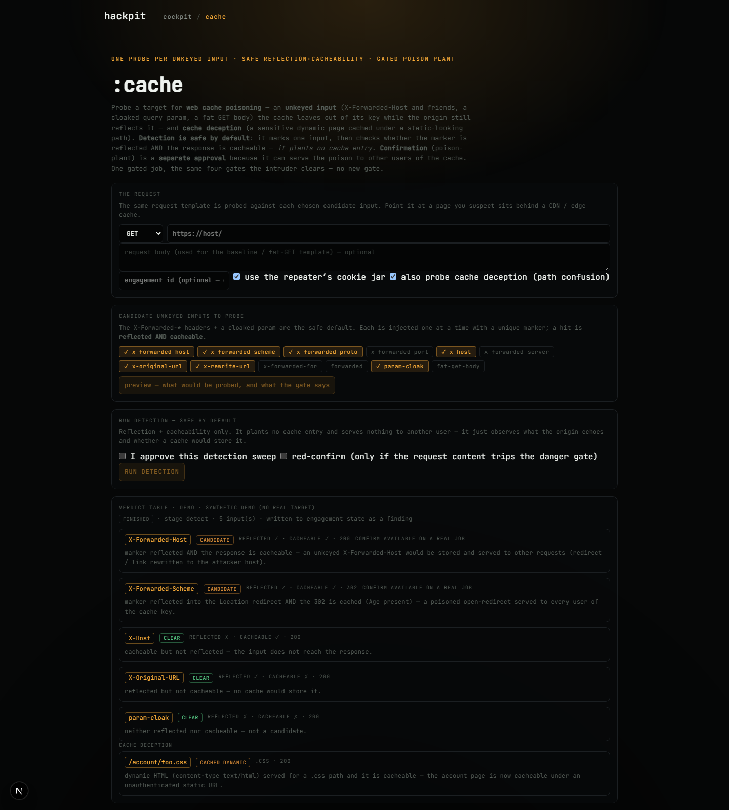

> The screenshot uses a **synthetic verdict set** — never a real target — where `X-Forwarded-Host` / `X-Forwarded-Scheme` are reflected into a cacheable response (candidates) and `/account/foo.css` returns cached dynamic HTML (a deception hit). A real job points the same box at an in-scope target under one approval.

### Guided recon → ranked attack surface

The front door a bounty or pentest actually starts from. Give **`:recon`** a scoped domain and it runs recon as **approved jobs**, seeds the engagement's structured state (hosts/services/endpoints), and **ranks the surface** so you know what to hit first. A **passive sweep** — bug-bounty safe, the default — chains `subfinder → dnsx → httpx → gau/waybackurls/katana` for live hosts, tech, URLs and their parameters; an **active sweep** (one more approval) adds `naabu → nmap -sV` service detection. Each sweep is **one** approved job (the same `ffuf` / nuclei shape, **no new gate**) with an ungated stop, in the open engagement sandbox. **Scope is a correctness property here, not an extra gate**: every discovered host is sorted by the declared scope — in-scope names join the live allowed set and are the *only* hosts the probing tools are pointed at; out-of-scope names are surfaced **read-only** and never scanned or stored. Then `rank_surface` scores each host by likely-exploitable — open services, **CVE-worthy stacks** (via the 47k-exploit index), parameter-rich endpoints (IDOR/injection surface), auth surfaces, and any findings — and lists them with the *why*, each carrying a one-click handoff into `:attack-paths` and `:nuclei`. Advisory only: it proposes an order and runs nothing.

<p align="center">
  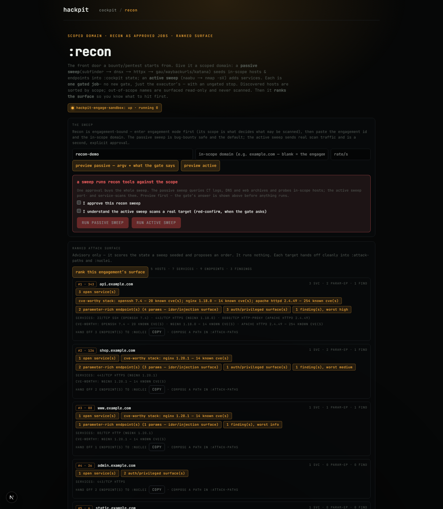
</p>

> One approval per sweep, ungated stop; discoveries can only widen the allowed set *within* the declared scope. Above, the ranked surface against a scoped `example.com` lab puts `api.example.com` on top — its OpenSSH 7.4 / nginx / Apache 2.4.49 stack, param-rich endpoints and a High SQLi finding earning the score — with each target handing off cleanly into `:attack-paths` and `:nuclei`.

### Credential attack

The payoff of the state model: **use** the credentials and hashes HackPit has already captured. **Spray** a user/password list across a service (SMB, WinRM, LDAP, SSH, Kerberos, an HTTP form…) or **crack** captured hashes with a wordlist — each is *one* approved job with an ungated stop, gated by the same executor gates every command clears. The user, password and hash lists are written to loot files and referenced by path, so no secret ever lands on the command line; the hashcat mode is detected from each hash's shape. A hit writes a **validated credential + a finding** back into engagement state and marks the matching principal **owned** in `:ad-graph`, opening new frontier edges — the loop closing.

<p align="center">
  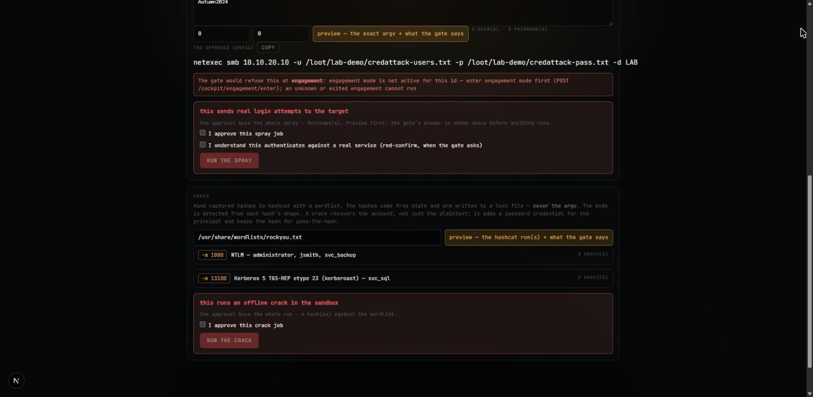
</p>

> Spray builds the exact `netexec` command — with the user/password lists as loot files, never on the argv — and shows the gate's answer before anything runs; captured hashes are grouped by an auto-detected hashcat mode (NTLM, kerberoast, …), one approval per crack.

### Nuclei template scan

The bug-bounty staple, wired the HackPit way. Point **nuclei's** template engine at the scoped target(s) — paste a list, or leave it blank and let the default set be the engagement's in-scope endpoints already in state — and filter by **severity** and **template tag**. It runs as **one** approved job (the same `ffuf` / ZAP-active-scan shape, **no new gate**) with an ungated stop, in the per-mode sandbox the rest of the cockpit resolves: the isolated lab box in lab mode, the fully-open one in engagement mode. Every match becomes a **severity-ranked `Finding`** in the same engagement state the report renders — `info.name` → title, `matched-at` → target, `template-id` → reference, curl/matcher output → evidence — deduplicated by `(template-id, matched-at)`. The live finding count grows as templates match, and the target rides the argv as `-u <target>` so an out-of-scope host is refused at the same target handrail every command gets.

<p align="center">
  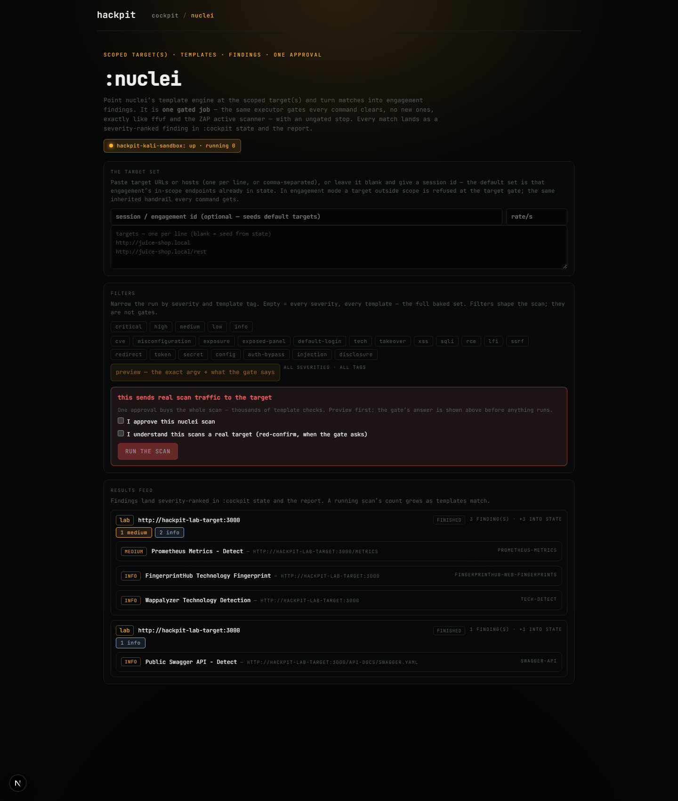
</p>

> One approval buys the whole scan; results land severity-ranked in `:cockpit` state and the report. Above, a real run against the lab surfaced a medium Prometheus-metrics exposure plus tech-fingerprint and Swagger findings — each deduped and upserted as an engagement finding.

### Out-of-band callbacks

Blind vulnerabilities (SSRF, blind XXE, some RCE) only prove themselves with a callback. HackPit gives you **two backends at once**: a self-hosted **OOB canary** and a zero-infrastructure **interact.sh** session — mint a payload URL, then watch DNS/HTTP interactions land, decrypted and correlated.

<p align="center">
  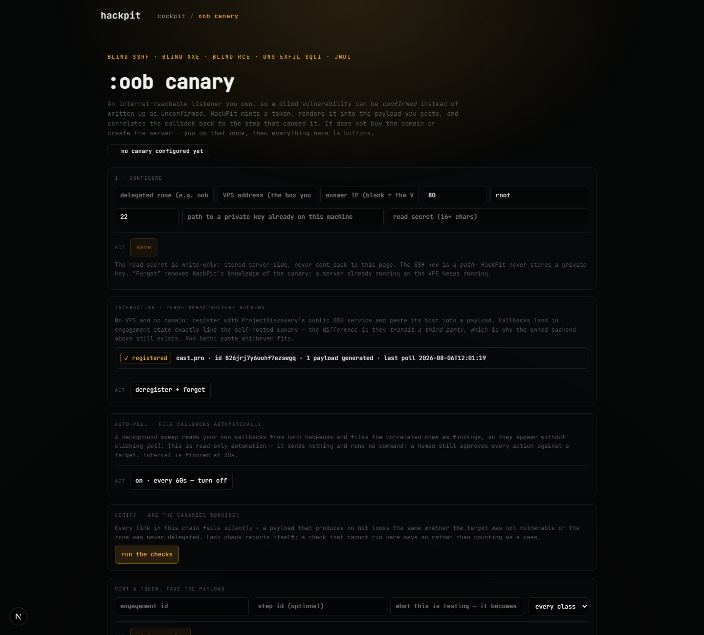
</p>

### Pivots, tunnels & C2

Route through a compromised host with **chisel / ligolo-ng**, with the `proxychains` wrap shown *before* you approve it (a tunnel's subnet only enters scope via an explicit, audited amendment). For post-ex, **Sliver implants**, a **listener panel**, and **DNS tunnels** — plus a public **C2 redirector** — are all present and all gated, with the build kept generate-only where it should be.

<p align="center">
  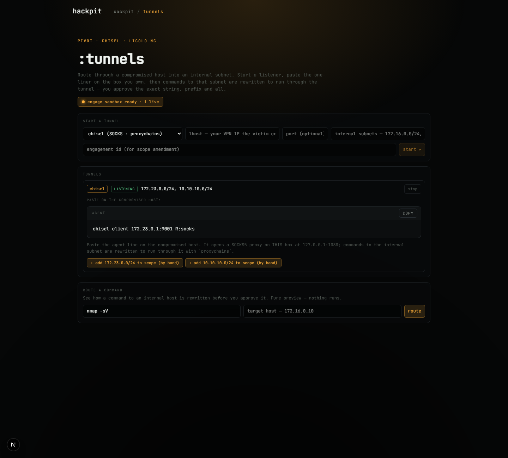
  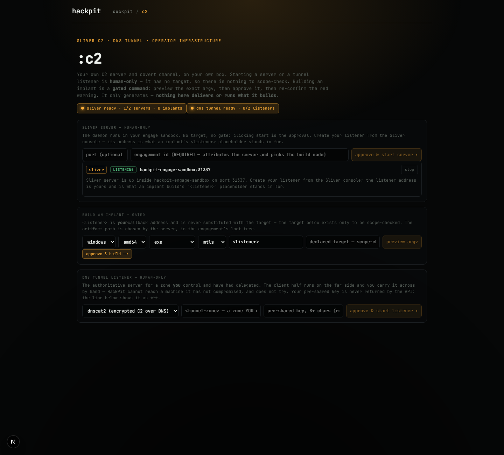
</p>

### Live sessions

Catch and drive one shell interactively, with **human-only stdin** and the same source-scan lock as `:kali`.

<p align="center">
  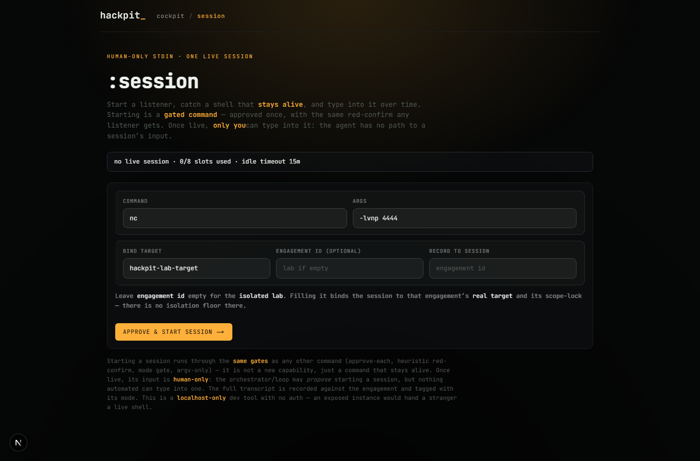
</p>

---

## 🪟 Windows & Active Directory

Ingest **BloodHound** data, get a typed graph, route to Domain Admin, and **walk the path** — the agent proposes an *edge to abuse* (never a raw command), you approve it, and it executes **live over WinRM** against a Windows/AD box you run. Advancing a step requires a run that was actually approved and exited 0, checked server-side.

<p align="center">
  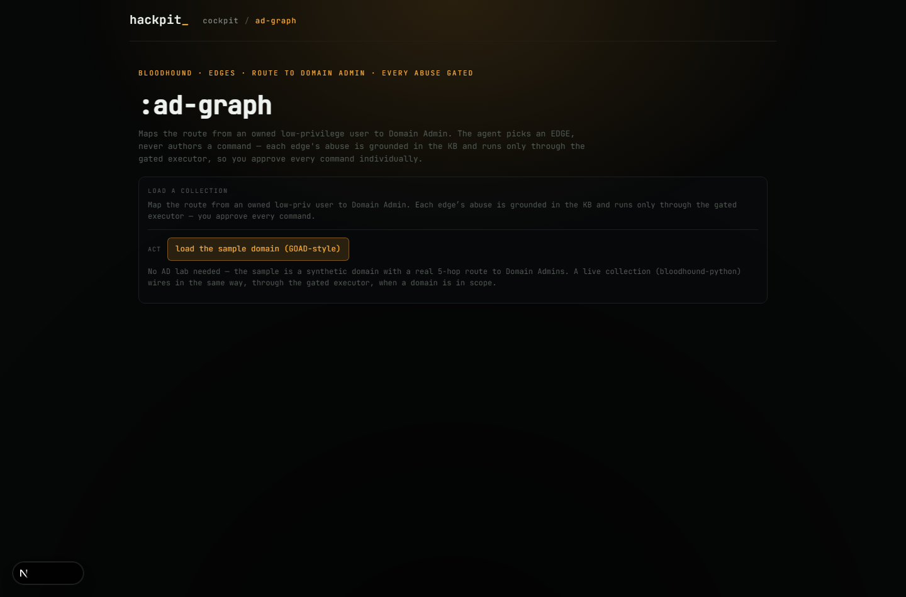
  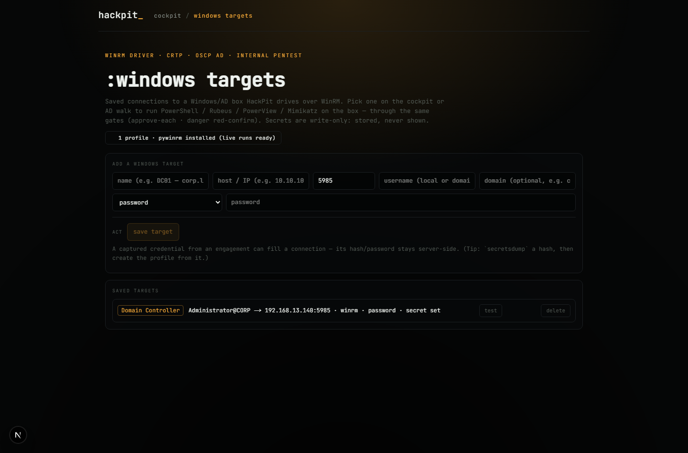
</p>

### 📄 AD CS: ESC1–8 routed in the graph

The same graph now **routes certificate-services abuse**. Feed it **`certipy find -json`** and it adds `certtemplate` / `certauthority` nodes and **synthesizes composite `ESC1…ESC8` edges** — exactly the way DCSync is synthesized from its two replication rights: a predicate over a template's misconfiguration **and** a low-priv enrollee's enroll right collapses to one edge from that enrollee to Domain Admins. ESC1/ESC6/ESC8 are the direct wins; **ESC4** (write control over a template) and **ESC7** (ManageCA) emit the *two-hop reconfigure-then-abuse* shape through the template/CA node. Each edge's abuse is grounded in the KB and resolves to a real `certipy req → auth` command (plus a native `Certify.exe` variant for the on-host CRTP path), and — like every abuse in the graph — it runs **only** through the gated executor, approve-each. `certipy find` itself runs as a gated, scope-locked enumeration job. No new gate; per-command human approval is the only bound.

<p align="center">
  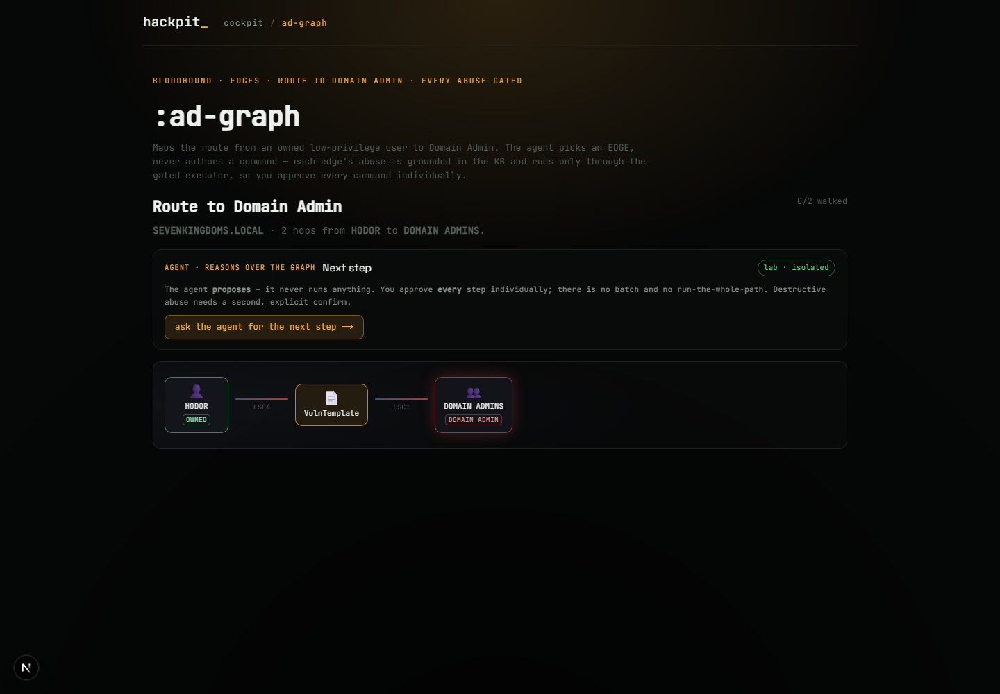
</p>

> No AD lab needed: the sample is a **synthetic vulnerable CA** (no real domain, CA, or account names) with a real ESC route — a low-priv user who can rewrite a template's config reconfigures it to be SAN-abusable (ESC4), then enrols a Domain Admin certificate (ESC1). A live `certipy find` wires in the same way, through the gated executor, when a domain is in scope.

### 🎫 Unconstrained delegation + golden/silver ticket forging

The same graph now finishes the **Kerberos-delegation family**. RBCD and constrained (S4U) delegation were already routable edges; the last one — **unconstrained delegation** — is now too. A host flagged `unconstraineddelegation` synthesizes a routable **`TrustedForDelegation`** edge to Domain Admins (synthesized from the flag exactly like RBCD is from `msDS-AllowedToActOnBehalfOfOtherIdentity`): own the host — the walk reaches it via `AdminTo` — **coerce a DC** to authenticate to it (printerbug / PetitPotam), **capture its TGT**, and **DCSync**. Its abuse is grounded in the KB and resolves to a real `krbrelayx + printerbug → secretsdump` chain, with a native `Rubeus monitor + SpoolSample → mimikatz dcsync` variant for the on-host CRTP path — and, like every abuse in the graph, it demands the destructive red-confirm and runs **only** through the gated executor, approve-each.

**Golden and silver ticket forging** ride alongside as **post-compromise persistence**, not routing edges: forging a ticket presupposes the very compromise the route exists to reach, so it is never walked by the path search or the orchestrator frontier. A **golden** ticket is offered on the domain node **only once krbtgt is held** (a DCSync / a captured DC TGT); a **silver** ticket on a service node **only once its account hash is held**. They surface in a distinct persistence panel with both an impacket (`ticketer`) and a mimikatz command — propose-only, gated behind the held secret.

<p align="center">
  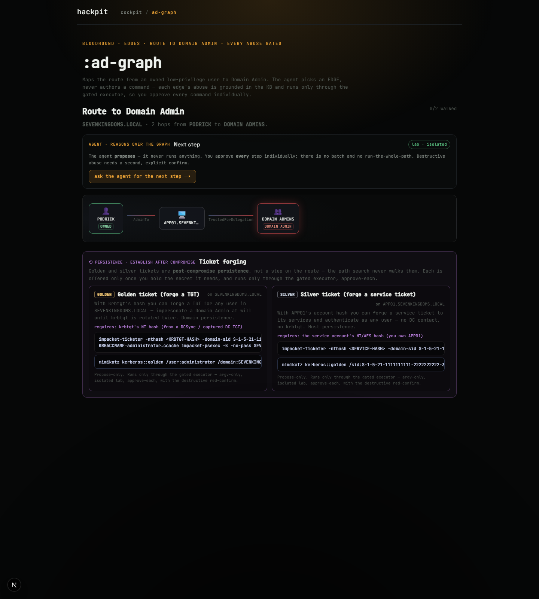
</p>

> No AD lab needed: the sample is a **synthetic member server** trusted for delegation (no real domain or host names). A low-priv user who is local admin on it routes `AdminTo → TrustedForDelegation → Domain Admins`, and the persistence panel offers golden/silver forging once you hold krbtgt / the host's hash. A live BloodHound collection wires in the same way, through the gated executor, when a domain is in scope.

---

## ☁️ Cloud attack surface & IAM privesc graph

The cloud parallel to the AD graph. Point **`:cloud-graph`** at an account and it enumerates as **one approved job** — `ScoutSuite` + `Prowler`, with `pacu` and `cloudfox` added to the arsenal and the sandbox image in this build — then parses their JSON into a **typed IAM privilege-escalation graph**: principals (users, roles, groups, service accounts) and resources (buckets, functions, secrets, KMS keys) wired by the abusable IAM relationships an attacker actually walks — `sts:AssumeRole`, `iam:PassRole`, `iam:AttachRolePolicy`, `iam:CreatePolicyVersion`, `lambda:UpdateFunctionCode`, Azure `Owner`-on-self / app-credential-add, GCP `serviceAccountTokenCreator` / `actAs`. A BFS over the abusable edges finds the shortest route to an **admin/owner-equivalent** principal, and — exactly like the AD graph — the agent **picks an edge to abuse (an index into the real frontier), never authors a command**: each edge's abuse is grounded in the 534-entry cloud KB (with the precise CLI catalog behind it) and runs **only** through the same gated executor, so you approve every command individually. Advancing the walk requires a run that was actually approved and exited 0, checked server-side. The privilege-escalation paths and Prowler misconfigurations land as **findings** in engagement state. Multi-cloud by construction (provider on every node); enumeration is AWS-end-to-end today with Azure/GCP node/edge and technique support in place.

<p align="center">
  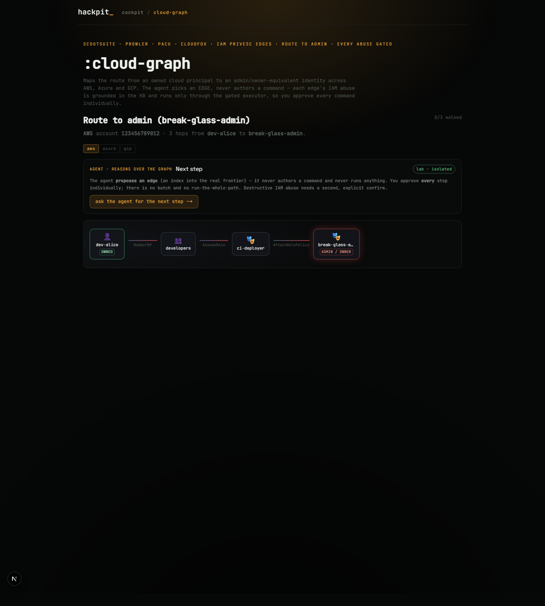
</p>

> No cloud credentials needed to see it work: the sample is a **synthetic AWS account** (no real account id, ARN or tenant) with a real 3-hop IAM privilege-escalation route to an admin role. A live enumeration wires in the same way — a gated job in the open engagement sandbox — when a real account is in scope.

### 🌉 Web SSRF → cloud credentials (the IMDS bridge)

The seam between the web/cockpit half and the cloud graph. A web-side **SSRF or RCE** that can reach the instance metadata service (`169.254.169.254`, or `metadata.google.internal` on GCP) hands back the instance's temporary role/identity token — the classic pivot from a web bug into the cloud control plane. The **"Seed from SSRF / IMDS"** panel on `:cloud-graph` takes that **captured response** — pasted, pulled from a **repeater** exchange, or arriving in an **OOB callback** body — parses the credentials + the identity behind them, and seeds them as an **owned** principal in the IAM graph, so the privesc walk begins from the identity you just stole. It covers **AWS** (IMDSv1 and the IMDSv2 token-PUT + creds-GET two-step, plus the role listing and instance-identity doc), **Azure** managed-identity JWTs (decoded for `oid`/`appid`/tenant), and **GCP** service-account tokens (with the `Metadata-Flavor: Google` header requirement flagged).

The bridge **executes nothing** — the request that actually touched IMDS ran through the human-approved repeater/nuclei/executor (or was an OOB callback); the module only parses a captured string and seeds the graph. When the stolen identity matches an already-enumerated node it marks that node **owned** (so a route to admin lights up immediately); otherwise it adds the owned principal standalone. The captured secret goes to the engagement **vault/loot**, and a high-severity **finding** is recorded with the provider, identity and token expiry — **never the secret itself**. A per-provider IMDS request cheat-set (curl/gopher, incl. the IMDSv2 two-step) sits next to the seed box as templates to approve-and-send through the repeater.

<p align="center">
  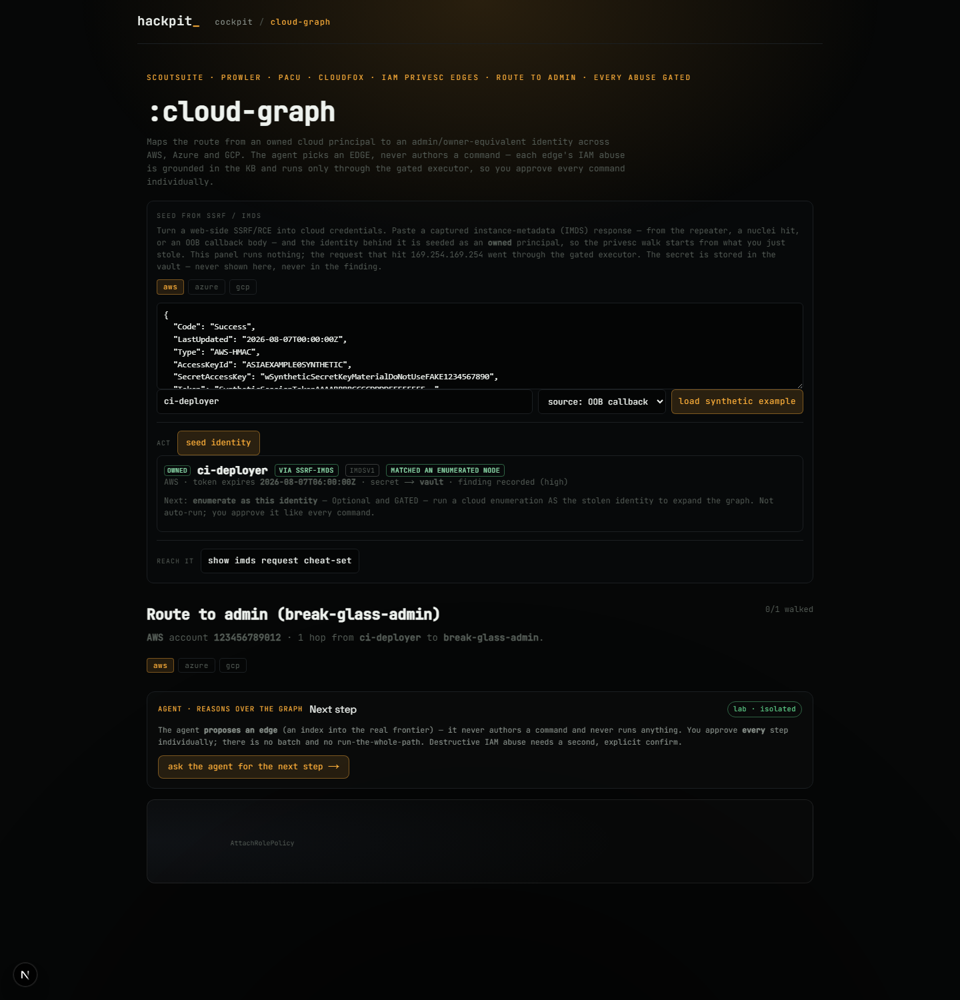
</p>

---

## ⛓️ Cross-domain kill-chain graph

The **capstone** over the three attack-path graphs. HackPit maps the web foothold, the cloud IAM graph, and the on-prem AD graph *separately* — **`:killchain`** stitches them into **one routed chain**, so a foothold in one lane routes to a high-value target in another. It is a **read-and-stitch overlay**: it reads each graph's public output and **executes nothing**, and it imports neither the cloud nor the AD graph package (they stay decoupled — the join lives in `main.py`). What it adds is the small, new catalog of **cross-domain seams** the lanes are joined by — `SsrfToImds` (web SSRF → cloud metadata creds), `NodeToCloud` (a compute/K8s node → its instance role), `WebToHost` (web RCE → a domain-joined host), `CloudToOnprem` (a cloud secret reused as an AD credential, or a sync-account / RunCommand pivot), `OnpremToCloud` (an AD-synced identity / service-principal cert / SYSVOL creds → the tenant) — each carrying its ATT&CK technique and, for the crossing itself, a KB-grounded-or-catalog command.

The screen renders **three swim-lanes** (web / cloud / on-prem) with the stitched path lit across them — each route node sits in its lane at its step column, so the path visibly descends through the lanes as it advances, and a cross-domain seam is drawn bright where a within-lane hop is dim. Exactly like the two per-lane graphs, the agent **picks an edge to abuse (an index into the real frontier), never authors a command**: a **cross-domain seam** resolves to a crossing command you approve through the same gated executor every cockpit command uses (with the defender's-eye ATT&CK/detection disclosure beside it), and a **within-lane hop defers to its own `:cloud` / `:ad-graph` view** — so there is one command catalog per abuse and no drifting copy. Advancing the chain requires a run that was actually approved and exited 0 for a seam hop, checked server-side; each step lands as a finding.

<p align="center">
  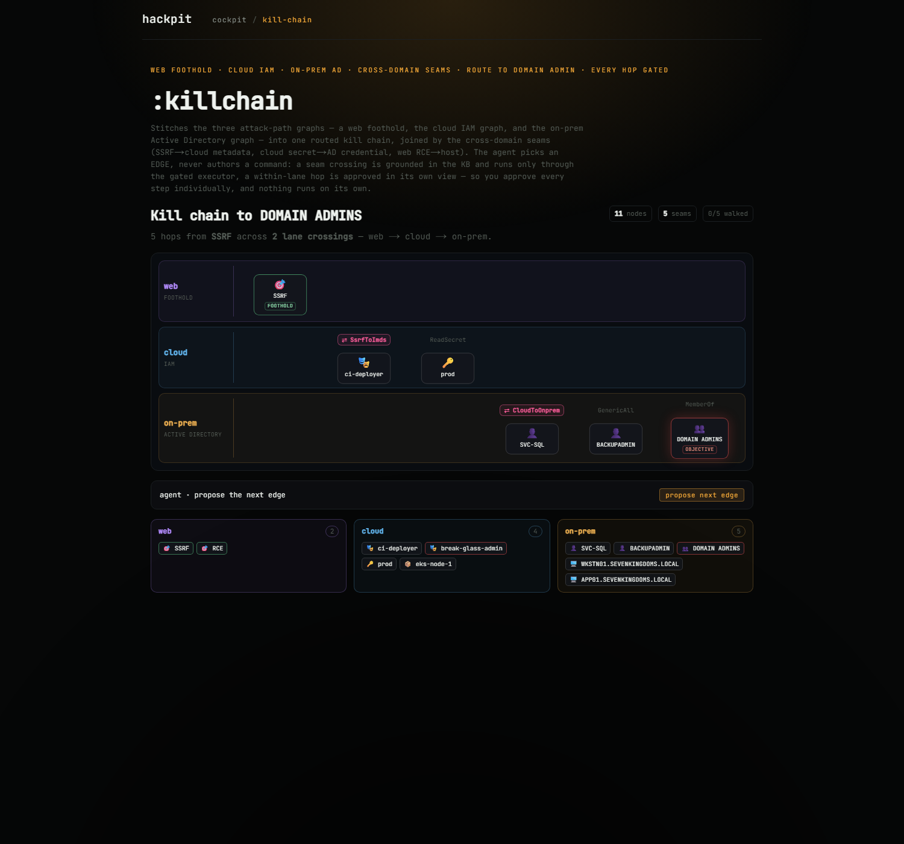
</p>

> No live data needed to see it work: the sample stitches a **synthetic** web→cloud→on-prem chain (no real host, account or domain) to Domain Admin across two cross-domain seams. Live lanes wire in from `:recon`/`:proxy` (web), `:cloud`, and `:ad-graph` as an engagement fills them — the overlay renders with whatever exists.

> All demo data is **synthetic** — the pasted IMDS body carries a fake account id, ARN and token, and the seeded `ci-deployer` role matches the synthetic sample account so the 1-hop route to the admin role lights up. Real SSRF captures wire in exactly the same way.

---

## 🛡️ Purple-team view & OPSEC

### Detection footprint

For any command, the **defender's view**: the ATT&CK techniques it maps to, the telemetry it throws, the Sigma rules that would fire, and how loud it is. Curated across **65 ATT&CK techniques and 49 Sigma rules**, and verified against **live upstream** ATT&CK/SigmaHQ rather than written from memory.

### Evasion & the OPSEC channel

An opt-in **OPSEC channel** gives the operator's honest counterpart — why a command is loud and what quieter tradecraft costs — under one hard rule: **every note must name what still records the activity anyway.** The blue-team footprint is always produced alongside and can't be suppressed. Evasion artifacts are **generate-only**.

<p align="center">
  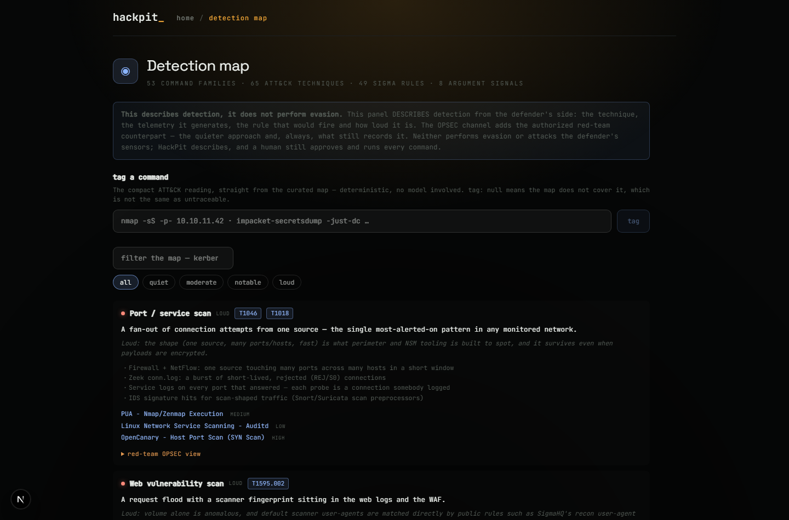
  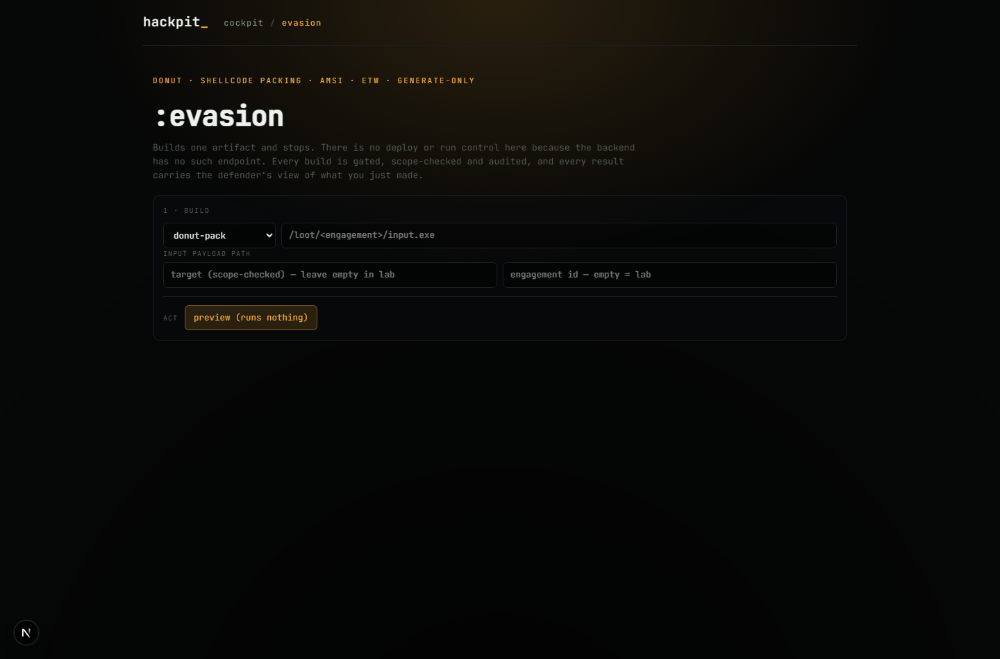
</p>

---

## 🧰 Arsenal, exploits & code scan

**155 tools / 361 invocation templates** catalogued with what each is for, its phase, and whether it actually runs in the image — so the planner proposes well-formed commands. A **CVE → exploit index** turns `vsftpd 2.3.4` into the exact exploit and CVE, version-compared over a local **47,108-exploit / 25,041-CVE** catalogue. A **code-scan** surface runs an **8-language SAST** bundle (Semgrep + Bandit) over source you point it at — deliberately isolated from the execution engine.

Two new categories close the binary/RE gap. **`binary-re`** — reversing & exploit-dev: Ghidra (`analyzeHeadless`), radare2, gdb, `checksec`, `objdump`/`readelf`/`nm`/`nasm`/`xxd`, `ROPgadget`/`ropper`, `one_gadget`, `pwntools`, `angr`, `libc-database`, `pwninit`, `patchelf`. **`forensics-ctf`** — memory / carving / stego: `volatility3`, `binwalk`, `foremost`, `scalpel`, `steghide`, `zsteg`, `stegseek`, `exiftool`, `bulk_extractor`, `testdisk`/`photorec`. Every entry is a **template over `<binary>`/`<file>`/`<libc>`** the planner can propose — **data + templates only, no auto-exec and no new gate**; a proposed `pwntools`/`angr` `-c` skeleton is arbitrary code, so it trips the same red-confirm every interpreter does, and runs only through the gated executor / `:kali` / `:terminal`, approved one at a time. New tooling is baked into the sandbox image (`docker/Dockerfile.sandbox`, verified by `docker/proof/binre_install_proof.sh` + `forensics_install_proof.sh`) — **image rebuild required** (`docker compose -f docker/docker-compose.yml build engage-sandbox`).

<p align="center">
  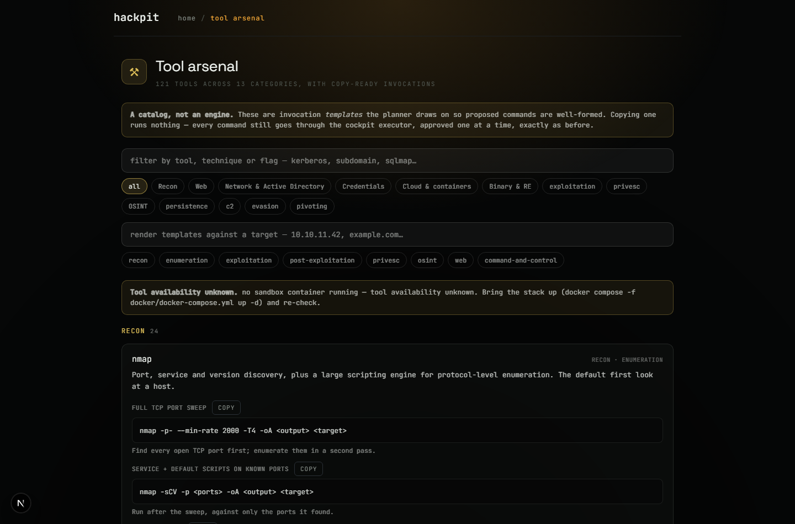
  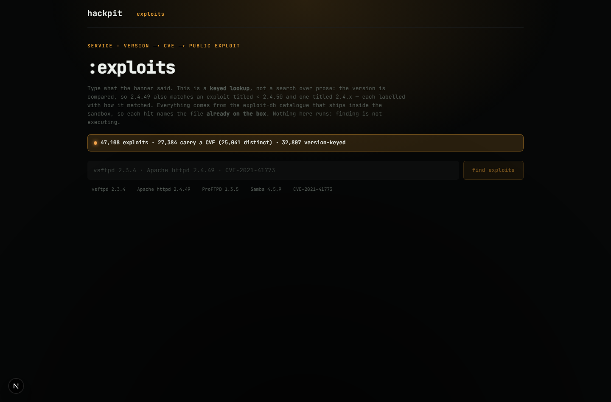
  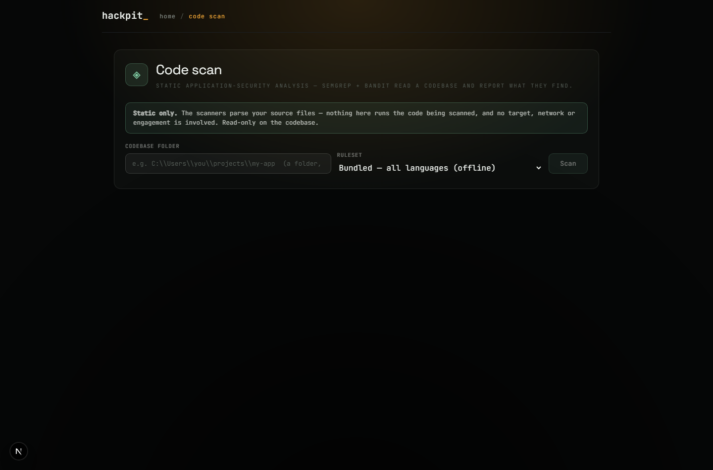
</p>

<p align="center">
  
</p>

### 🔬 AI code-audit fan-out

The rule scan pattern-matches file-by-file; the **AI audit** is the other half. Borrowing the context-saving decomposition from open·kritt, it **maps the repo's externally-reachable entrypoints and their flows once**, then hands each downstream agent **exactly one flow** to verify against source — so every agent spends its whole context on a single path and returns a **concrete vuln-with-attacker-path** (RCE, authz bypass, injection, SSRF, loss-of-funds) or an **honest no-finding stub**. Non-concrete claims are downranked to stubs, the rest are **deduped and severity-ranked** (`IMPACT_LEVELS`) into engagement findings with source refs. Each specialist is **KB-grounded**, and `patched-since` restricts the whole audit to a git diff — turning a huge repo into a reviewable delta.

It is HackPit-gated the whole way: the audit **reads source and proposes** — it runs no scanner against a target and executes nothing — so it is **one approved job, no new gate** (the ZAP / nuclei justification, one approval buys the whole fan-out). Any PoC a finding offers is a **string to run approve-each** through the existing executor in the :kali sandbox, never auto-run. When no LLM is reachable it degrades to a deterministic heuristic analyst that runs the same three stages, which is what the shot below shows on a bundled synthetic sample repo.

<p align="center">
  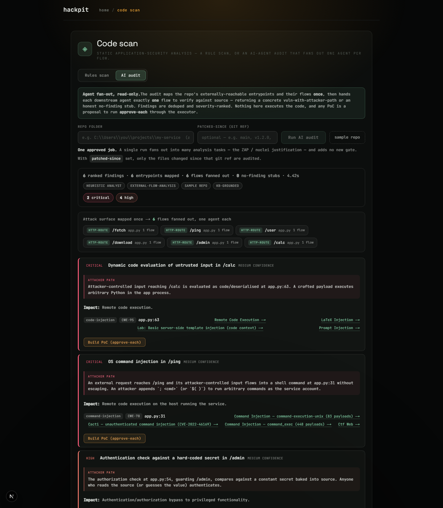
</p>

### ⛓️ Web3 / smart-contract audit

The same fan-out ships **three built-in playbooks** — ported from open·kritt's proven `external-flow-analysis` and `Cosmos ABCI Panic Halt Review` (the decompositions the Blockian team turned into $1.5M of bounties), plus an Anchor one:

- **`evm-external-flow`** (Solidity) — enumerate external/public functions → trace flows (value transfers, state changes, external calls, oracle reads, access-control branches) → per-flow: **reentrancy**, missing/incorrect **access control**, **oracle manipulation** (staleness / flash-loan-manipulable spot price), unchecked arithmetic, delegatecall hijack — the **loss-of-funds** classes.
- **`cosmos-abci-halt`** (Go / Cosmos-SDK) — enumerate the wired ABCI methods → fan out **four panic classes** (explicit panic, arithmetic underflow/div-zero, `Must*` helpers, bounds/type) → keep only the panics that are **attacker-triggerable AND production-reachable inside consensus** — a **chain halt**.
- **`anchor-solana`** (Rust / Anchor) — enumerate instructions → check account validation, signer, CPI and arithmetic → **missing-owner-check**, **signer-spoof**, **integer-overflow**, **CPI-confusion**.

Each finding is **chain / contract / function-tagged** and **KB-grounded** in new smart-contract methodology entries, and every playbook can chain an **approve-each tool pass** — proposed **slither / mythril / echidna / forge** commands (never run from here; confirmed one-by-one in the :kali sandbox, output parsed back into the same finding shape). Adds **no new gate**: the analysis reads source and proposes, exactly like the web-app audit next to it. New tooling in the arsenal + sandbox image (`slither`, `mythril`, `echidna`, `foundry`, `semgrep`, `cargo`/`clippy`, `gosec`) — **image rebuild required** (`docker compose build engage-sandbox`, verified by `docker/proof/web3_install_proof.sh`). The shot below is the deterministic analyst on a bundled deliberately-vulnerable Solidity fixture.

<p align="center">
  
</p>

### ▣ Finding pipeline — one schema, auto-dedup, pluggable rankers, post-scripts

The fan-out above is the heaviest producer of findings, but **every** surface makes them — recon, nuclei, AD, cloud, the SSRF→IMDS bridge, the manual paste box. Borrowing open·kritt's finding-processing machinery, the pipeline gives them all one spine:

- **Dynamic / structured schema.** Every finding carries a consistent, machine-checkable shape — title, severity, **attacker-path**, **source-refs**, **CVSS**, vuln-class — plus an `extra` map for **engagement-defined custom fields**. Malformed findings are rejected; unknown fields are preserved, not dropped.
- **Automatic de-duplication.** The same defect found via two flows, or reported by two tools worded differently, **collapses by a stable key** (location + type) into one finding that keeps the worst severity and the union of source-refs — idempotently, so re-ingesting never multiplies. A **"merged N duplicates"** note surfaces what was folded.
- **Pluggable severity rankers.** A per-engagement rule set rescopes severity into `critical…info`. Ship two lenses over the *same* findings: **bug-bounty payout** (RCE / loss-of-funds / auth-bypass to the top, best-practice noise to info) and **compliance** (header & crypto control gaps rise to medium, raw exploitation criticals capped) — the missing-header one view discards as noise is a real control gap in the other.
- **Post-scripts.** An operator step that runs **after a finding lands**: **validate** (re-check it is actionable — composes with the validation gates) and **draft a report** (feed report-writer) run **in-process and execute nothing**; **build a PoC** returns an **approve-each** command the operator fires through the gated executor + :kali sandbox. A lock refuses a concurrent double-run.

Ranking, dedup and schema are **pure data operations** — they add **no gate**; only a command post-script touches the executor, and only approve-each. The live preview below (on `/engagements`, over a synthetic finding set) shows the ranker picker, the merged badges and the post-scripts panel.

<p align="center">
  
</p>

### ⧉ Workflow builder — author your own playbooks over the fan-out

The three built-in playbooks are hard-coded decompositions. The **workflow builder** (`/workflows`, ported from open·kritt's workflow authoring UI) is the layer that lets an operator compose their *own*. A **workflow** is an ordered set of **steps**; each step is a focused prompt plus an output schema plus a fan-out shape:

- **Variables** — `{{repo}}`, `{{ref}}`, `{{playbook}}`, the per-item `{{item}}`, and any **prior step's output** by dotted ref (`{{steps.enumerate.output.0.entrypoints}}`), plus operator-defined and per-run **extra** variables. `render_prompt` / `resolve_ref` are ported verbatim; an unresolved ref renders empty, never a literal `{{x}}`.
- **Batches** — a step fans out **one agent per item** of a list variable (the map-once / verify-each primitive, generalised).
- **Depth & siblings** — `depth` re-expands a step's list output into child generations; `siblings` runs parallel branches per task. Both are **bounded** (`MAX_SIBLINGS`, `MAX_DEPTH`, and a total-task ceiling), so a fan-out can never run away.
- **Import / export** — serialise a workflow to a portable JSON and load one back. An imported workflow is **stored and surfaced for inspection — never auto-run**: you read every step prompt, then choose to run it.

Compose a workflow, preview its **static fan-out plan**, export it, re-import it, and run it. **Authoring executes nothing** — create / edit / import / export only read and write a store. **Running** is the audit's **one approved job** (no new gate): each step renders its prompt, calls the same injected LLM agent, threads outputs downstream, and the concrete findings are deduped + severity-ranked by the shared pass. A **command** step is a *proposal* — a rendered command string the operator runs approve-each in the :kali sandbox — never fired from here. The two proven built-ins (**external-flow** web-app + **evm-external-flow** Solidity) ship visible on first load and run offline via their playbook's deterministic analyst.

<p align="center">
  
</p>

---

## 🔌 MCP server — eyes, not hands

HackPit ships an optional **Model Context Protocol server** (`backend/mcp_server.py`) exposing **15 read-only tools** — KB search, arsenal lookup, exploit lookup, engagement state, findings, proxy history, scan status, command-scope checks, and a *propose* (not execute) hook. It lets another AI client **observe and reason about** your engagement without ever touching an execution surface. That boundary is proven in CI: the tool registry imports nothing from the execution layer, and a safety test enumerates every exposed tool.

---

## 🤖 Multi-provider LLM — Claude by default, swappable

The default composer is the **Claude Agent SDK (Opus)** — it runs through your local `claude` CLI (Claude Code) with **no API key**, so a machine already signed into Claude Code reasons on a frontier model out of the box. Every other provider is one config change away, and the choice is honest about where your data goes:

| Provider | Model(s) | Notes |
|---|---|---|
| **Claude Agent SDK** *(default)* | `opus` (or `sonnet` / `haiku`) | No key — uses your Claude Code login. Prompts go to Anthropic. |
| **Ollama** *(offline)* | `qwen3:8b`, `nomic-embed-text`, `llava` | Fully local — nothing leaves the machine. The automatic fallback if the `claude` CLI is unavailable. |
| **OpenAI · Anthropic · OpenRouter** | your choice | Drop an API key and swap without touching code. |

Embeddings for the vector half of search always run locally on **Ollama** (`nomic-embed-text`), independent of the composer you pick.

---

## 🔒 Safety model

This is the part worth reading first, because it constrains everything else.

**Four ordered gates, on every command.** Nothing executes without passing all four:

| Gate | What it does |
|---|---|
| **Human approval** | Every command needs an explicit approve. No batch approval, no risk-tiered auto-run, no autonomous loop. |
| **Scope lock** | In engagement mode the target must be in a scope you declared. Default-deny — an out-of-scope host is refused, not warned about. |
| **Red confirm** | A heuristic flags dangerous commands (interpreters, reverse shells, payload generators, tunnels, RCE tooling) and demands a second acknowledgement that names *what* it flagged. |
| **Audit** | Every action — including refusals that ran nothing — is recorded. |

**No autonomy — enforced, not promised.** The agent proposes; it never executes. Source-scan tests assert that no orchestrator, loop, or agent module has any code path to an execution surface, and they **fail the build** if one appears. For Active Directory the agent picks an *edge index*, never a command — it can't invent a host or author a command outside the graph.

**Three sandboxes, deliberately different.** The **lab** container is *egress-less* — no route to the internet, your LAN, or your host — proven by a live Docker isolation check the executor's fourth gate depends on. The **`:kali`** container is an open bridge for the human-only shell. The **engagement** container is fully open and privileged by design, because a real target is on the internet; there the bound is the scope lock and per-command approval, **not** network isolation.

**Describe, then prescribe — never one without the other.** The detection layer is describe-only and guarded against drifting into evasion advice. The OPSEC channel may be prescriptive, but only if every note names what still records the activity — and the blue-team footprint is always produced alongside and can't be suppressed.

**93 test files**, run as one hermetic suite (`sh backend/run_safety_tests.sh`). Many exist purely to prove a guard *fires* — including planted-violation controls, because a safety test that can't fail is not evidence.

---

## ⚖️ Security posture & honest limits

Stated plainly rather than left to be discovered:

- **No authentication on any route.** No key, no session, no `Depends`. CORS is pinned to `localhost:3000`. On a laptop this is fine; **on any non-localhost box it is an unauthenticated RCE endpoint** — the `:kali` routes run arbitrary shell in a container with full reach to your host and LAN, and the `:terminal` WebSocket is effectively an unauthenticated shell. **Auth is a hard blocker before any VPS/non-localhost deployment.**
- **Some live proofs are deferred.** The C2 and covert-channel surfaces are verified *structurally* (their containment is locked by tests), but a real beacon calling back, a delegated DNS zone, and a detonated artifact on an instrumented host need a VPS and are deliberately **not yet run**. Efficacy is documented, not demonstrated.
- **A self-scan flagged SSRF/CORS** in HackPit's own backend — tracked, worth revisiting before any exposure.
- **Thin KB categories** (mobile, IoT, forensics, ICS) are unfilled by choice — none are on the target list.

---

## 🏗️ How it works

```
                    ┌────────────────────────────────────────────────┐
  raw sources  ──▶  │  pipeline/  — ingest · normalize · consolidate  │
  (external,        │  dedupe (alias-key + cosine) · embed (Ollama)   │
   gitignored)      └────────────────────────────────────────────────┘
                                         │  builds
                                         ▼
                    ┌────────────────────────────────────────────────┐
                    │  data/kb/  — one deduplicated, attributed KB    │
                    │  entries.jsonl · embeddings.npy   (gitignored)  │
                    └────────────────────────────────────────────────┘
                                         │  served by
                                         ▼
   FastAPI backend  ──  hybrid search · attack paths · engagement state
        │                detection footprints · reports · MCP server     ──  local Ollama
        │  the four gates:  approve → scope → red-confirm → audit
        ▼
   cockpit  ──▶  docker exec (argv-only, never a shell)
        ├─ lab container         egress-less, isolation-proven
        ├─ :kali / engagement    open bridge, scope-locked, human-approved
        └─ WinRM                 an external Windows/AD target you run
                                         │  HTTP / SSE / WebSocket
                                         ▼
   Next.js frontend  ──  27 screens: search · paths · cockpit · AD · detection · reports
```

**The grounding philosophy:** answers cite real techniques, and anything generated beyond the library is marked. Attack-path steps prefer your write-ups, then KB-grounded techniques; only a genuine gap gets an `AI-SUGGESTED · VERIFY` step. Whole-box write-ups are kept out of the grounding pool so a step is always a focused technique — and a model-suggested detection footprint is re-grounded and can never introduce a Sigma rule of its own.

---

## 📚 Knowledge base

**2,747 entries synthesized from 15+ sources** into one deduplicated, source-attributed library across **33 categories** — web & bug bounty (645), cloud (534), write-ups, network services, Active Directory, privilege escalation, pwn, methodology, Windows, reference and more. **132 are tier-1 "your own notes."**

1. **Ingest** each source in its native shape (Markdown, cheat sheets, course notes, box write-ups, PDFs, payload lists).
2. **Normalize** to one entry schema — title, summary, tested commands, tool tags, category, tier.
3. **Consolidate** — alias-key + cosine finds the merge target, content is structurally merged (not concatenated), provenance recorded. Re-runs are idempotent.
4. **Embed** every entry locally for the vector half of search.
5. **Attribute** — the richest home becomes the spine; the rest surface as "also covered in" chips.

> **On sources & provenance.** The KB is **adapted and synthesized** from the author's own notes plus public community resources (HackTricks, PayloadsAllTheThings, PortSwigger and others). Raw sources are **not redistributed** — they're ingested locally into a private index, and both the raw trees and the built KB are **git-ignored and never committed.** A fresh clone's search is empty until you build the KB locally or obtain it from the author. This repo ships **code only**.

---

## 🧱 Tech stack

| Layer | Stack |
|---|---|
| **Frontend** | Next.js 16 (App Router), React 19, TypeScript 5, Tailwind CSS v4 |
| **Backend** | FastAPI, Uvicorn, NumPy, Python 3.14 |
| **Execution** | Docker — one Kali image, three containers with different runtime postures |
| **Search** | Hybrid BM25 (lexical) + vector (cosine over local embeddings) |
| **LLM (default)** | Claude Agent SDK (Opus) via the local `claude` CLI — no API key |
| **LLM (offline)** | Ollama — `qwen3:8b`, `nomic-embed-text`, `llava` |
| **LLM (API, optional)** | OpenAI · Anthropic · OpenRouter (key-swappable) |
| **Windows/AD** | `pywinrm` (NTLM/Negotiate, pass-the-hash) — optional, live-target only |
| **Detection data** | ATT&CK v19 + SigmaHQ, verified against live upstream |
| **Integration** | Model Context Protocol server (15 read-only tools) |
| **Tests / CI** | 93 plain-script suites, no pytest; CI runs the hermetic suite + frontend build + eslint on every push |

---

## 🚀 Running it

**Prerequisites:** [Ollama](https://ollama.com), Python 3.14+, Node 18+, and Docker (for the cockpit). HackPit uses [`uv`](https://docs.astral.sh/uv/) for the backend.

```bash
# 1. Local models (one-time)
ollama pull qwen3:8b
ollama pull nomic-embed-text

# 2. Config
cp .env.example .env       # set OLLAMA_BASE_URL (and any provider keys you want)

# 3. Backend — KB + search + attack paths + cockpit API on :8000
cd backend
uv run uvicorn main:app --reload

# 4. Frontend — the UI on :3000
cd frontend
npm install
npm run dev
```

Then open **http://localhost:3000**.

For the cockpit, bring the sandboxes up and verify the safety invariants:

```bash
docker compose -f docker/docker-compose.yml up -d --build
sh backend/run_safety_tests.sh                # hermetic suite
sh backend/run_safety_tests.sh --with-proof   # + live Docker isolation proof
```

> The KB (`data/`) is built by `pipeline/` from external source trees and is git-ignored. Point the pipeline at your own sources, or wire the backend to your own `entries.jsonl`. Optional extras (`uv pip install ...`): `semgrep bandit` (code scan), `pypdf` (PDF ingest), `pywinrm` (live Windows targets), `mcp` (the MCP server).

---

## 🗂️ Project structure

```
HackPit/
├── frontend/    Next.js UI — 27 screens: search, paths, cockpit, AD, detection, reports
├── backend/     FastAPI — KB, search, composition, gated execution, state, reports, MCP
│   ├── cockpit/     execution + the four gates + sandboxes + sessions + tunnels
│   ├── detection/   ATT&CK / Sigma footprints and the OPSEC channel
│   ├── state/       hosts · services · creds · findings · task tree
│   ├── arsenal/     the 121-tool catalog and its templates
│   ├── adgraph/     BloodHound + certipy (AD CS ESC1–8) ingest → typed graph → routing
│   ├── exploits/    CVE → exploit index (local exploit-db)
│   ├── codescan/    multi-language SAST rules (offline-first)
│   ├── evasion/     generate-only artifact producer
│   ├── reasoning/   the propose-only planning copilot
│   ├── oob/         out-of-band canary + interact.sh integration
│   └── mcp_server.py / mcp_tools.py   the read-only MCP surface
├── pipeline/    ingest → normalize → consolidate → embed  (the KB build engine)
├── oob/         the standalone out-of-band canary server (internet-facing component)
├── redirector/  the public C2 redirector
├── docker/      the Kali image, compose postures, isolation proofs
├── docs/        design notes, decision log, the full capability assessment
├── sources/     per-source manifests (raw trees git-ignored — never committed)
├── data/        built KB + embeddings            (git-ignored — never committed)
└── assets/      screenshots for this README
```

---

## ✅ Project state

Actively built. The KB, search, attack paths, engagements, reports, cockpit, web-app testing surface, detection layer, AD graph, state model, Windows/WinRM driver, C2/tunnels, OOB backends, and MCP server are all implemented and covered by the safety suite. See `docs/` for the full capability assessment and the decision log — including the reasoning behind the choices that were reversed.

---

## 📄 License

Licensed under the **[Apache License 2.0](LICENSE)**. Offensive-security tooling for **authorized testing and education only** — see the [Authorized use only](#️-authorized-use-only) notice above.

---

<!-- Zaid's own voice — "Why I built it" goes here. Left intentionally blank for you to fill. -->
## Why I built it

<!-- TODO(Zaid): your own words. -->

---

## 🛠️ Build notes — a case study

<!-- Draft in a first-person voice for you to keep, cut, or rewrite. -->

HackPit was as much an experiment in **AI-native development** as it was an offensive-security tool. I didn't hand-write every layer — I directed a model through the build and made the architecture, safety, and integration calls in between. Here's the honest version of how it went.

**The pipeline**

- **Code, tests & the safety architecture** — built with **Claude (Claude Code, Opus)**, with me directing the design, the four-gate model, and every safety invariant. The project is now 90+ test files of guards, many of which exist only to prove a gate *fires*.
- **The knowledge base** — synthesized from my own notes plus public sources through a local `ingest → normalize → consolidate → embed` pipeline, with embeddings on Ollama's `nomic-embed-text`. Raw sources stay git-ignored; only the pipeline and per-source manifests ship.
- **The reasoning** — the attack-path composer and cockpit planner run on the same Claude Agent SDK the app now defaults to, grounded so they can only cite techniques the KB actually holds.

**What broke, and how I fixed it** — the fixes are the engineering:

- **A green test suite hid real bugs.** Live-fire runs found defects the hermetic suite couldn't. The out-of-band backend decrypted callbacks with the wrong AES mode (CFB instead of CTR) — and the hermetic test *agreed with its own bug*; only a real round-trip against a public OAST server caught it.
- **A safety gate that could be side-stepped.** The danger heuristic classified the first token of a WinRM command while the transport ran the whole joined script — so the red-confirm could be dodged on that path. Found by reading the code adversarially, recorded rather than papered over.
- **"OK" is not a result.** A crawl returned `{"Result":"OK"}` and zero URLs three different ways (a loopback-bound container, Chromium refusing to run as root, ZAP preferring its own bundled chromedriver) before I learned to assert the *outcome*, never the exit code.
- **The frontend can't be trusted to the type-checker.** `tsc`, `next build`, and eslint can't see whether a CSS class exists or an animation actually reveals — a screen isn't verified until it's been *looked at*. (Even the screenshots in this README are captured headlessly and then eyeballed one by one.)

**What I'd do differently / roadmap**

- **Authentication.** Every route is unauthenticated; localhost-only is the current mitigation and a hard blocker before any non-localhost deployment. It's the next thing.
- **Prove the deferred surfaces in the field.** The C2 callback, a delegated DNS zone, and a detonated artifact on an instrumented host need a VPS — they're verified structurally today, not live.
- **Grow tier-1.** The KB is 2,747 entries but only 132 are my own authored notes — the highest-leverage work left is writing, not ingesting.

Honestly: the safety model is the part I'm most careful about, and it's also the part that most constrained the "just let it run" fun — which is exactly the point.

---

<p align="center">
  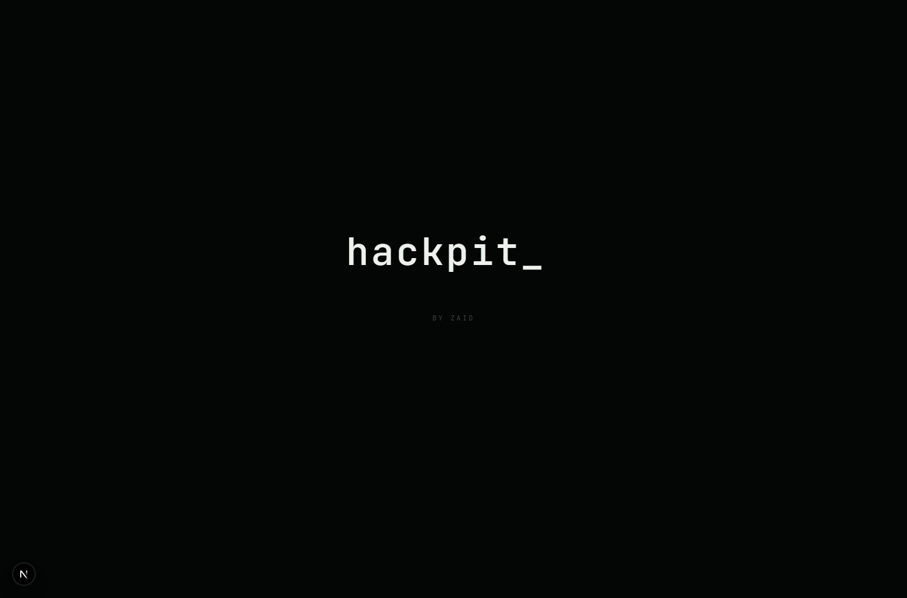
</p>

<p align="center"><sub>Every technique you know, one keystroke away.</sub></p>
