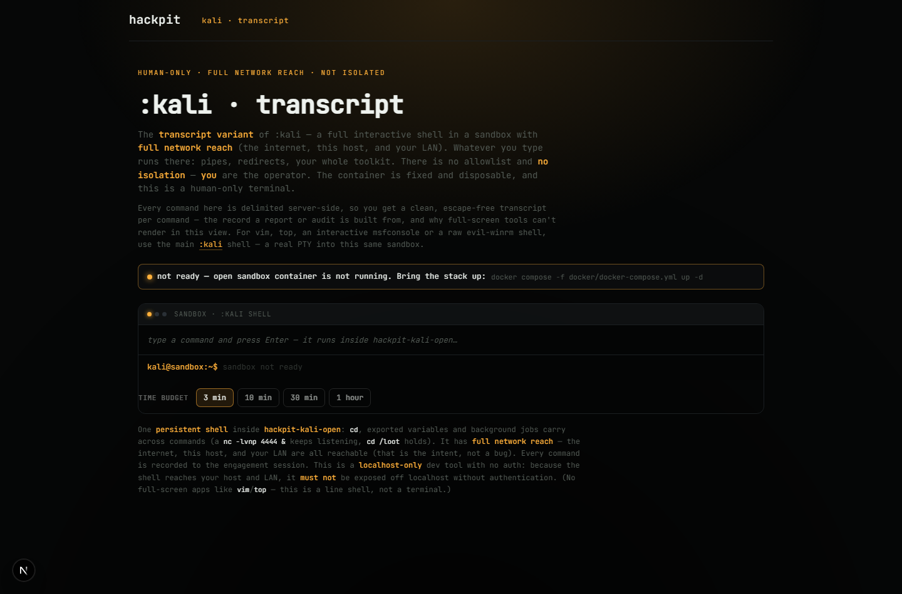
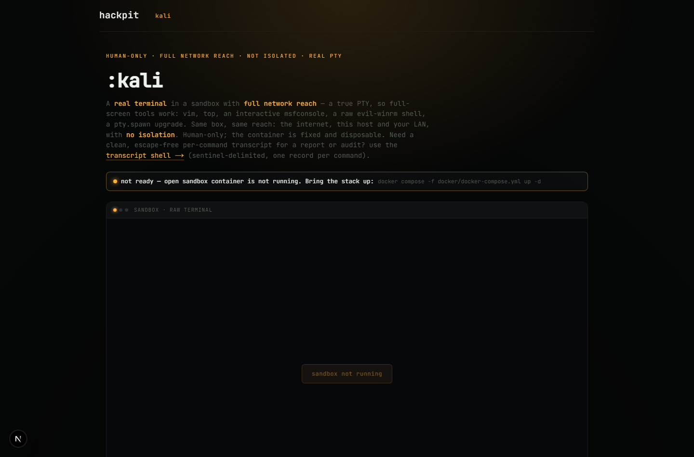

<!-- logo -->
<!-- ▶ DEMO VIDEO — Zaid: drop the demo video / GIF embed here -->

<h1 align="center">HackPit</h1>

<p align="center">
  <em>Another AI that hacks?</em> Sort of. This one reads a career's worth of <strong>your own</strong> pentest notes,
  plans the whole engagement, and drives real Kali tooling —<br>
  and it never fires a single command you didn't approve.
</p>

<p align="center">
  <a href="https://github.com/Zaidzyy/HackPit/actions/workflows/ci.yml"></a>
  <a href="LICENSE"></a>
  
  
  
  
  
  
  
  
  
</p>

HackPit is an **AI-driven offensive-security companion with a gated execution cockpit**. It started as one thing — turn a scattered pile of pentest notes into a single searchable knowledge base — and grew into a second: a Kali cockpit where the AI plans the attack and you approve every command it runs.

Two ideas make it different from "an LLM that hacks":

- **Grounded, not generated.** Every answer cites a real technique from *your* library. Commands come from the knowledge base, never invented by the model — and anything the AI does add is clearly badged `AI-SUGGESTED · VERIFY`.
- **Proposes, never fires.** The agent plans the whole kill-chain, but a human approves each command individually. There is no autonomous mode — and that's a deliberate design choice, enforced in code, not a missing feature.

It runs **local-first** — the knowledge base, hybrid search, and every execution surface stay on your machine. The default AI composer is the **Claude Agent SDK (Opus)**, driven through your local Claude Code login with no API key; switch to local **Ollama** any time you want a fully-offline setup where nothing leaves at all.

<p align="center">
  
</p>

> ### ⚠️ Authorized use only
> The cockpit runs **real offensive tools against real hosts** — with C2, evasion tooling, and a live Windows/AD path. Use it only where you're authorized: your own lab, an HTB/PG box, or a client with a signed scope. Every command is gated on your explicit approval, and in engagement mode on a target you declared in scope. **Engagement mode has no network containment** — human approval is the only thing standing between a command and the internet. Read the [Safety model](#-safety-model); it's the core of the design, not a footnote.

> ### 📦 This public repo ships code only
> The knowledge sources the KB is built from — course notes, write-ups, cloned repos, PDFs, cheat sheets — are kept **local and git-ignored, never committed**. What *is* committed: the pipeline that builds the KB, plus per-source **manifests** (`sources/*-manifest.md`) recording each source's URL · date · commit SHA · verdict. The built KB itself (`data/`) is generated locally — **a fresh clone starts with an empty knowledge base until you build one or get it from the author.**

---

## What you get, at a glance

| | |
|---|---|
| 🔎 **Knowledge base + hybrid search** | 2,747 deduped, source-attributed techniques across 33 categories. `⌘K` finds them by meaning. |
| 🧭 **Guided attack paths** | Recon → privesc walkthroughs, write-up-first, KB-grounded, AI gap-fill clearly marked. |
| 🎯 **Gated cockpit** | Real Kali execution, one approved command at a time, behind four ordered gates. |
| ◈ **Guided recon** | Scoped domain → recon as approved jobs → ranked attack surface; discoveries can only widen the set *within* scope. |
| 🕸️ **Web app testing** | Recording proxy, repeater, intruder, GraphQL, browser interception, OOB callbacks. |
| ◎ **Nuclei template scan** | Scoped target(s) → templates → severity-ranked findings, one approval; results flow into engagement state. |
| 🪟 **Windows / AD** | BloodHound graph → route to Domain Admin → walk it live over WinRM. |
| ☁️ **Cloud IAM privesc** | ScoutSuite/Prowler/pacu/cloudfox → typed IAM graph → route to an admin/owner identity across AWS/Azure/GCP; the agent picks an edge, you approve every command. |
| 🔑 **Credential attack** | Spray captured/OSINT creds, crack captured hashes — one approval per job; secrets stay in loot files, a hit lights the AD graph. |
| 📡 **C2 & tunnels** | Sliver implants, DNS tunnels, pivots, a public redirector — all gated. |
| 🛡️ **Purple-team view** | The defender's-eye footprint of every command, with an honest OPSEC channel. |
| 📝 **Grounded reports** | OSCP/CPTS/H1 templates, evidence spliced from real state, CVSS computed not asserted. |
| 🧰 **Arsenal · exploits · SAST** | 123-tool catalog, a 47k-exploit CVE index, and an 8-language code scanner. |
| 🔌 **MCP server** | 15 read-only tools so another AI agent can *see* your engagement — eyes, not hands. |

---

## 🧠 The companion

### Consolidated knowledge base + hybrid search

Every entry is a focused, copy-ready technique with real commands, tool tags, and full source attribution. The same technique from several sources is merged into **one** entry that shows how many sources it came from and which others also cover it — provenance without the clutter. Search is **hybrid BM25 + vector**, so `⌘K` finds the right thing by meaning, not exact words.

<p align="center">
  
  
</p>

Some entries are **your own** — original methodology you wrote, badged `HACKPIT-AUTHORED` and treated as tier-1 "your notes."

<p align="center">
  
</p>

### Guided attack paths

Describe a target and HackPit composes an ordered **recon → enumeration → exploitation → privesc → post-ex** plan. The grounding order is deliberate: your own box **write-up first**, then **KB-grounded** steps that reuse exact commands, and only where the library has a gap does the model add an **`AI-SUGGESTED · VERIFY`** step. A target-profiler reads your goal and scope so a WordPress blog and a multi-tenant SaaS get different playbooks; pivotal steps carry *if it works →* / *if blocked →* branches, and any out-of-scope host you paste is dropped.

<p align="center">
  
  
</p>

### Engagements, assistant & grounded reports

Turn a path into a **living engagement** — checked steps, pasted evidence, captured hosts/creds/findings that persist. A **session-aware assistant** answers against your actual progress and cites real techniques. One click drafts a **grounded report** (exec summary, scope, methodology, attack narrative) built from your evidence — with OSCP-style proof tables and **CVSS 3.1 computed, not asserted**.

Every saved path lives in one place, with its own progress and evidence tracked locally:

<p align="center">
  
</p>

Open one and it's a working engagement; finish it and the report writes itself from what you actually did:

<p align="center">
  
  
</p>
<p align="center">
  
  
</p>

### Scripts arsenal

Every runnable script and payload across the whole KB — **extracted, deduped, and grouped by type** (reverse shells, web payloads, delivery, persistence, privesc, enumeration), each with a reuse count and links back to its entries.

<p align="center">
  
</p>

---

## 🎯 The cockpit — gated execution

A Kali container driven from the UI, **one approved command at a time**. From here the AI plans a path, then you walk it — in an isolated lab, against a scoped real target, or on a Windows box over WinRM.

<p align="center">
  
</p>

### `:kali` and `:terminal` — two shells, on purpose

`:kali` is a persistent shell that logs a clean, per-command transcript (what your reports are built from). `:terminal` is a **real PTY** in the same box, so `top`, `vim`, and interactive tools render. Both are human-driven — typing *is* the approval — and both are fully audited.

<p align="center">
  
  
</p>

### Web application testing

A full web surface behind the same gates: a **recording proxy** that captures traffic, an **HTTP repeater** to compose/send/replay/diff requests, an **intruder** for fuzzing (one approval can buy many requests, so it's flagged as such), **browser interception** that publishes the proxy to a real Chrome for sites that refuse a bare toolchain, and end-to-end **GraphQL** support — engine fingerprinting, field-suggestion enumeration, and a repeater round-trip where your raw body wins.

<p align="center">
  
  
</p>
<p align="center">
  
  
</p>

### Guided recon → ranked attack surface

The front door a bounty or pentest actually starts from. Give **`:recon`** a scoped domain and it runs recon as **approved jobs**, seeds the engagement's structured state (hosts/services/endpoints), and **ranks the surface** so you know what to hit first. A **passive sweep** — bug-bounty safe, the default — chains `subfinder → dnsx → httpx → gau/waybackurls/katana` for live hosts, tech, URLs and their parameters; an **active sweep** (one more approval) adds `naabu → nmap -sV` service detection. Each sweep is **one** approved job (the same `ffuf` / nuclei shape, **no new gate**) with an ungated stop, in the open engagement sandbox. **Scope is a correctness property here, not an extra gate**: every discovered host is sorted by the declared scope — in-scope names join the live allowed set and are the *only* hosts the probing tools are pointed at; out-of-scope names are surfaced **read-only** and never scanned or stored. Then `rank_surface` scores each host by likely-exploitable — open services, **CVE-worthy stacks** (via the 47k-exploit index), parameter-rich endpoints (IDOR/injection surface), auth surfaces, and any findings — and lists them with the *why*, each carrying a one-click handoff into `:attack-paths` and `:nuclei`. Advisory only: it proposes an order and runs nothing.

<p align="center">
  
</p>

> One approval per sweep, ungated stop; discoveries can only widen the allowed set *within* the declared scope. Above, the ranked surface against a scoped `example.com` lab puts `api.example.com` on top — its OpenSSH 7.4 / nginx / Apache 2.4.49 stack, param-rich endpoints and a High SQLi finding earning the score — with each target handing off cleanly into `:attack-paths` and `:nuclei`.

### Credential attack

The payoff of the state model: **use** the credentials and hashes HackPit has already captured. **Spray** a user/password list across a service (SMB, WinRM, LDAP, SSH, Kerberos, an HTTP form…) or **crack** captured hashes with a wordlist — each is *one* approved job with an ungated stop, gated by the same executor gates every command clears. The user, password and hash lists are written to loot files and referenced by path, so no secret ever lands on the command line; the hashcat mode is detected from each hash's shape. A hit writes a **validated credential + a finding** back into engagement state and marks the matching principal **owned** in `:ad-graph`, opening new frontier edges — the loop closing.

<p align="center">
  
</p>

> Spray builds the exact `netexec` command — with the user/password lists as loot files, never on the argv — and shows the gate's answer before anything runs; captured hashes are grouped by an auto-detected hashcat mode (NTLM, kerberoast, …), one approval per crack.

### Nuclei template scan

The bug-bounty staple, wired the HackPit way. Point **nuclei's** template engine at the scoped target(s) — paste a list, or leave it blank and let the default set be the engagement's in-scope endpoints already in state — and filter by **severity** and **template tag**. It runs as **one** approved job (the same `ffuf` / ZAP-active-scan shape, **no new gate**) with an ungated stop, in the per-mode sandbox the rest of the cockpit resolves: the isolated lab box in lab mode, the fully-open one in engagement mode. Every match becomes a **severity-ranked `Finding`** in the same engagement state the report renders — `info.name` → title, `matched-at` → target, `template-id` → reference, curl/matcher output → evidence — deduplicated by `(template-id, matched-at)`. The live finding count grows as templates match, and the target rides the argv as `-u <target>` so an out-of-scope host is refused at the same target handrail every command gets.

<p align="center">
  
</p>

> One approval buys the whole scan; results land severity-ranked in `:cockpit` state and the report. Above, a real run against the lab surfaced a medium Prometheus-metrics exposure plus tech-fingerprint and Swagger findings — each deduped and upserted as an engagement finding.

### Out-of-band callbacks

Blind vulnerabilities (SSRF, blind XXE, some RCE) only prove themselves with a callback. HackPit gives you **two backends at once**: a self-hosted **OOB canary** and a zero-infrastructure **interact.sh** session — mint a payload URL, then watch DNS/HTTP interactions land, decrypted and correlated.

<p align="center">
  
</p>

### Pivots, tunnels & C2

Route through a compromised host with **chisel / ligolo-ng**, with the `proxychains` wrap shown *before* you approve it (a tunnel's subnet only enters scope via an explicit, audited amendment). For post-ex, **Sliver implants**, a **listener panel**, and **DNS tunnels** — plus a public **C2 redirector** — are all present and all gated, with the build kept generate-only where it should be.

<p align="center">
  
  
</p>

### Live sessions

Catch and drive one shell interactively, with **human-only stdin** and the same source-scan lock as `:kali`.

<p align="center">
  
</p>

---

## 🪟 Windows & Active Directory

Ingest **BloodHound** data, get a typed graph, route to Domain Admin, and **walk the path** — the agent proposes an *edge to abuse* (never a raw command), you approve it, and it executes **live over WinRM** against a Windows/AD box you run. Advancing a step requires a run that was actually approved and exited 0, checked server-side.

<p align="center">
  
  
</p>

---

## ☁️ Cloud attack surface & IAM privesc graph

The cloud parallel to the AD graph. Point **`:cloud-graph`** at an account and it enumerates as **one approved job** — `ScoutSuite` + `Prowler`, with `pacu` and `cloudfox` added to the arsenal and the sandbox image in this build — then parses their JSON into a **typed IAM privilege-escalation graph**: principals (users, roles, groups, service accounts) and resources (buckets, functions, secrets, KMS keys) wired by the abusable IAM relationships an attacker actually walks — `sts:AssumeRole`, `iam:PassRole`, `iam:AttachRolePolicy`, `iam:CreatePolicyVersion`, `lambda:UpdateFunctionCode`, Azure `Owner`-on-self / app-credential-add, GCP `serviceAccountTokenCreator` / `actAs`. A BFS over the abusable edges finds the shortest route to an **admin/owner-equivalent** principal, and — exactly like the AD graph — the agent **picks an edge to abuse (an index into the real frontier), never authors a command**: each edge's abuse is grounded in the 534-entry cloud KB (with the precise CLI catalog behind it) and runs **only** through the same gated executor, so you approve every command individually. Advancing the walk requires a run that was actually approved and exited 0, checked server-side. The privilege-escalation paths and Prowler misconfigurations land as **findings** in engagement state. Multi-cloud by construction (provider on every node); enumeration is AWS-end-to-end today with Azure/GCP node/edge and technique support in place.

<p align="center">
  
</p>

> No cloud credentials needed to see it work: the sample is a **synthetic AWS account** (no real account id, ARN or tenant) with a real 3-hop IAM privilege-escalation route to an admin role. A live enumeration wires in the same way — a gated job in the open engagement sandbox — when a real account is in scope.

---

## 🛡️ Purple-team view & OPSEC

### Detection footprint

For any command, the **defender's view**: the ATT&CK techniques it maps to, the telemetry it throws, the Sigma rules that would fire, and how loud it is. Curated across **65 ATT&CK techniques and 49 Sigma rules**, and verified against **live upstream** ATT&CK/SigmaHQ rather than written from memory.

### Evasion & the OPSEC channel

An opt-in **OPSEC channel** gives the operator's honest counterpart — why a command is loud and what quieter tradecraft costs — under one hard rule: **every note must name what still records the activity anyway.** The blue-team footprint is always produced alongside and can't be suppressed. Evasion artifacts are **generate-only**.

<p align="center">
  
  
</p>

---

## 🧰 Arsenal, exploits & code scan

**121 tools / 306 invocation templates** catalogued with what each is for, its phase, and whether it actually runs in the image — so the planner proposes well-formed commands. A **CVE → exploit index** turns `vsftpd 2.3.4` into the exact exploit and CVE, version-compared over a local **47,108-exploit / 25,041-CVE** catalogue. A **code-scan** surface runs an **8-language SAST** bundle (Semgrep + Bandit) over source you point it at — deliberately isolated from the execution engine.

<p align="center">
  
  
  
</p>

---

## 🔌 MCP server — eyes, not hands

HackPit ships an optional **Model Context Protocol server** (`backend/mcp_server.py`) exposing **15 read-only tools** — KB search, arsenal lookup, exploit lookup, engagement state, findings, proxy history, scan status, command-scope checks, and a *propose* (not execute) hook. It lets another AI client **observe and reason about** your engagement without ever touching an execution surface. That boundary is proven in CI: the tool registry imports nothing from the execution layer, and a safety test enumerates every exposed tool.

---

## 🤖 Multi-provider LLM — Claude by default, swappable

The default composer is the **Claude Agent SDK (Opus)** — it runs through your local `claude` CLI (Claude Code) with **no API key**, so a machine already signed into Claude Code reasons on a frontier model out of the box. Every other provider is one config change away, and the choice is honest about where your data goes:

| Provider | Model(s) | Notes |
|---|---|---|
| **Claude Agent SDK** *(default)* | `opus` (or `sonnet` / `haiku`) | No key — uses your Claude Code login. Prompts go to Anthropic. |
| **Ollama** *(offline)* | `qwen3:8b`, `nomic-embed-text`, `llava` | Fully local — nothing leaves the machine. The automatic fallback if the `claude` CLI is unavailable. |
| **OpenAI · Anthropic · OpenRouter** | your choice | Drop an API key and swap without touching code. |

Embeddings for the vector half of search always run locally on **Ollama** (`nomic-embed-text`), independent of the composer you pick.

---

## 🔒 Safety model

This is the part worth reading first, because it constrains everything else.

**Four ordered gates, on every command.** Nothing executes without passing all four:

| Gate | What it does |
|---|---|
| **Human approval** | Every command needs an explicit approve. No batch approval, no risk-tiered auto-run, no autonomous loop. |
| **Scope lock** | In engagement mode the target must be in a scope you declared. Default-deny — an out-of-scope host is refused, not warned about. |
| **Red confirm** | A heuristic flags dangerous commands (interpreters, reverse shells, payload generators, tunnels, RCE tooling) and demands a second acknowledgement that names *what* it flagged. |
| **Audit** | Every action — including refusals that ran nothing — is recorded. |

**No autonomy — enforced, not promised.** The agent proposes; it never executes. Source-scan tests assert that no orchestrator, loop, or agent module has any code path to an execution surface, and they **fail the build** if one appears. For Active Directory the agent picks an *edge index*, never a command — it can't invent a host or author a command outside the graph.

**Three sandboxes, deliberately different.** The **lab** container is *egress-less* — no route to the internet, your LAN, or your host — proven by a live Docker isolation check the executor's fourth gate depends on. The **`:kali`** container is an open bridge for the human-only shell. The **engagement** container is fully open and privileged by design, because a real target is on the internet; there the bound is the scope lock and per-command approval, **not** network isolation.

**Describe, then prescribe — never one without the other.** The detection layer is describe-only and guarded against drifting into evasion advice. The OPSEC channel may be prescriptive, but only if every note names what still records the activity — and the blue-team footprint is always produced alongside and can't be suppressed.

**93 test files**, run as one hermetic suite (`sh backend/run_safety_tests.sh`). Many exist purely to prove a guard *fires* — including planted-violation controls, because a safety test that can't fail is not evidence.

---

## ⚖️ Security posture & honest limits

Stated plainly rather than left to be discovered:

- **No authentication on any route.** No key, no session, no `Depends`. CORS is pinned to `localhost:3000`. On a laptop this is fine; **on any non-localhost box it is an unauthenticated RCE endpoint** — the `:kali` routes run arbitrary shell in a container with full reach to your host and LAN, and the `:terminal` WebSocket is effectively an unauthenticated shell. **Auth is a hard blocker before any VPS/non-localhost deployment.**
- **Some live proofs are deferred.** The C2 and covert-channel surfaces are verified *structurally* (their containment is locked by tests), but a real beacon calling back, a delegated DNS zone, and a detonated artifact on an instrumented host need a VPS and are deliberately **not yet run**. Efficacy is documented, not demonstrated.
- **A self-scan flagged SSRF/CORS** in HackPit's own backend — tracked, worth revisiting before any exposure.
- **Thin KB categories** (mobile, IoT, forensics, ICS) are unfilled by choice — none are on the target list.

---

## 🏗️ How it works

```
                    ┌────────────────────────────────────────────────┐
  raw sources  ──▶  │  pipeline/  — ingest · normalize · consolidate  │
  (external,        │  dedupe (alias-key + cosine) · embed (Ollama)   │
   gitignored)      └────────────────────────────────────────────────┘
                                         │  builds
                                         ▼
                    ┌────────────────────────────────────────────────┐
                    │  data/kb/  — one deduplicated, attributed KB    │
                    │  entries.jsonl · embeddings.npy   (gitignored)  │
                    └────────────────────────────────────────────────┘
                                         │  served by
                                         ▼
   FastAPI backend  ──  hybrid search · attack paths · engagement state
        │                detection footprints · reports · MCP server     ──  local Ollama
        │  the four gates:  approve → scope → red-confirm → audit
        ▼
   cockpit  ──▶  docker exec (argv-only, never a shell)
        ├─ lab container         egress-less, isolation-proven
        ├─ :kali / engagement    open bridge, scope-locked, human-approved
        └─ WinRM                 an external Windows/AD target you run
                                         │  HTTP / SSE / WebSocket
                                         ▼
   Next.js frontend  ──  27 screens: search · paths · cockpit · AD · detection · reports
```

**The grounding philosophy:** answers cite real techniques, and anything generated beyond the library is marked. Attack-path steps prefer your write-ups, then KB-grounded techniques; only a genuine gap gets an `AI-SUGGESTED · VERIFY` step. Whole-box write-ups are kept out of the grounding pool so a step is always a focused technique — and a model-suggested detection footprint is re-grounded and can never introduce a Sigma rule of its own.

---

## 📚 Knowledge base

**2,747 entries synthesized from 15+ sources** into one deduplicated, source-attributed library across **33 categories** — web & bug bounty (645), cloud (534), write-ups, network services, Active Directory, privilege escalation, pwn, methodology, Windows, reference and more. **132 are tier-1 "your own notes."**

1. **Ingest** each source in its native shape (Markdown, cheat sheets, course notes, box write-ups, PDFs, payload lists).
2. **Normalize** to one entry schema — title, summary, tested commands, tool tags, category, tier.
3. **Consolidate** — alias-key + cosine finds the merge target, content is structurally merged (not concatenated), provenance recorded. Re-runs are idempotent.
4. **Embed** every entry locally for the vector half of search.
5. **Attribute** — the richest home becomes the spine; the rest surface as "also covered in" chips.

> **On sources & provenance.** The KB is **adapted and synthesized** from the author's own notes plus public community resources (HackTricks, PayloadsAllTheThings, PortSwigger and others). Raw sources are **not redistributed** — they're ingested locally into a private index, and both the raw trees and the built KB are **git-ignored and never committed.** A fresh clone's search is empty until you build the KB locally or obtain it from the author. This repo ships **code only**.

---

## 🧱 Tech stack

| Layer | Stack |
|---|---|
| **Frontend** | Next.js 16 (App Router), React 19, TypeScript 5, Tailwind CSS v4 |
| **Backend** | FastAPI, Uvicorn, NumPy, Python 3.14 |
| **Execution** | Docker — one Kali image, three containers with different runtime postures |
| **Search** | Hybrid BM25 (lexical) + vector (cosine over local embeddings) |
| **LLM (default)** | Claude Agent SDK (Opus) via the local `claude` CLI — no API key |
| **LLM (offline)** | Ollama — `qwen3:8b`, `nomic-embed-text`, `llava` |
| **LLM (API, optional)** | OpenAI · Anthropic · OpenRouter (key-swappable) |
| **Windows/AD** | `pywinrm` (NTLM/Negotiate, pass-the-hash) — optional, live-target only |
| **Detection data** | ATT&CK v19 + SigmaHQ, verified against live upstream |
| **Integration** | Model Context Protocol server (15 read-only tools) |
| **Tests / CI** | 93 plain-script suites, no pytest; CI runs the hermetic suite + frontend build + eslint on every push |

---

## 🚀 Running it

**Prerequisites:** [Ollama](https://ollama.com), Python 3.14+, Node 18+, and Docker (for the cockpit). HackPit uses [`uv`](https://docs.astral.sh/uv/) for the backend.

```bash
# 1. Local models (one-time)
ollama pull qwen3:8b
ollama pull nomic-embed-text

# 2. Config
cp .env.example .env       # set OLLAMA_BASE_URL (and any provider keys you want)

# 3. Backend — KB + search + attack paths + cockpit API on :8000
cd backend
uv run uvicorn main:app --reload

# 4. Frontend — the UI on :3000
cd frontend
npm install
npm run dev
```

Then open **http://localhost:3000**.

For the cockpit, bring the sandboxes up and verify the safety invariants:

```bash
docker compose -f docker/docker-compose.yml up -d --build
sh backend/run_safety_tests.sh                # hermetic suite
sh backend/run_safety_tests.sh --with-proof   # + live Docker isolation proof
```

> The KB (`data/`) is built by `pipeline/` from external source trees and is git-ignored. Point the pipeline at your own sources, or wire the backend to your own `entries.jsonl`. Optional extras (`uv pip install ...`): `semgrep bandit` (code scan), `pypdf` (PDF ingest), `pywinrm` (live Windows targets), `mcp` (the MCP server).

---

## 🗂️ Project structure

```
HackPit/
├── frontend/    Next.js UI — 27 screens: search, paths, cockpit, AD, detection, reports
├── backend/     FastAPI — KB, search, composition, gated execution, state, reports, MCP
│   ├── cockpit/     execution + the four gates + sandboxes + sessions + tunnels
│   ├── detection/   ATT&CK / Sigma footprints and the OPSEC channel
│   ├── state/       hosts · services · creds · findings · task tree
│   ├── arsenal/     the 121-tool catalog and its templates
│   ├── adgraph/     BloodHound ingest → typed graph → routing
│   ├── exploits/    CVE → exploit index (local exploit-db)
│   ├── codescan/    multi-language SAST rules (offline-first)
│   ├── evasion/     generate-only artifact producer
│   ├── reasoning/   the propose-only planning copilot
│   ├── oob/         out-of-band canary + interact.sh integration
│   └── mcp_server.py / mcp_tools.py   the read-only MCP surface
├── pipeline/    ingest → normalize → consolidate → embed  (the KB build engine)
├── oob/         the standalone out-of-band canary server (internet-facing component)
├── redirector/  the public C2 redirector
├── docker/      the Kali image, compose postures, isolation proofs
├── docs/        design notes, decision log, the full capability assessment
├── sources/     per-source manifests (raw trees git-ignored — never committed)
├── data/        built KB + embeddings            (git-ignored — never committed)
└── assets/      screenshots for this README
```

---

## ✅ Project state

Actively built. The KB, search, attack paths, engagements, reports, cockpit, web-app testing surface, detection layer, AD graph, state model, Windows/WinRM driver, C2/tunnels, OOB backends, and MCP server are all implemented and covered by the safety suite. See `docs/` for the full capability assessment and the decision log — including the reasoning behind the choices that were reversed.

---

## 📄 License

Licensed under the **[Apache License 2.0](LICENSE)**. Offensive-security tooling for **authorized testing and education only** — see the [Authorized use only](#️-authorized-use-only) notice above.

---

<!-- Zaid's own voice — "Why I built it" goes here. Left intentionally blank for you to fill. -->
## Why I built it

<!-- TODO(Zaid): your own words. -->

---

## 🛠️ Build notes — a case study

<!-- Draft in a first-person voice for you to keep, cut, or rewrite. -->

HackPit was as much an experiment in **AI-native development** as it was an offensive-security tool. I didn't hand-write every layer — I directed a model through the build and made the architecture, safety, and integration calls in between. Here's the honest version of how it went.

**The pipeline**

- **Code, tests & the safety architecture** — built with **Claude (Claude Code, Opus)**, with me directing the design, the four-gate model, and every safety invariant. The project is now 90+ test files of guards, many of which exist only to prove a gate *fires*.
- **The knowledge base** — synthesized from my own notes plus public sources through a local `ingest → normalize → consolidate → embed` pipeline, with embeddings on Ollama's `nomic-embed-text`. Raw sources stay git-ignored; only the pipeline and per-source manifests ship.
- **The reasoning** — the attack-path composer and cockpit planner run on the same Claude Agent SDK the app now defaults to, grounded so they can only cite techniques the KB actually holds.

**What broke, and how I fixed it** — the fixes are the engineering:

- **A green test suite hid real bugs.** Live-fire runs found defects the hermetic suite couldn't. The out-of-band backend decrypted callbacks with the wrong AES mode (CFB instead of CTR) — and the hermetic test *agreed with its own bug*; only a real round-trip against a public OAST server caught it.
- **A safety gate that could be side-stepped.** The danger heuristic classified the first token of a WinRM command while the transport ran the whole joined script — so the red-confirm could be dodged on that path. Found by reading the code adversarially, recorded rather than papered over.
- **"OK" is not a result.** A crawl returned `{"Result":"OK"}` and zero URLs three different ways (a loopback-bound container, Chromium refusing to run as root, ZAP preferring its own bundled chromedriver) before I learned to assert the *outcome*, never the exit code.
- **The frontend can't be trusted to the type-checker.** `tsc`, `next build`, and eslint can't see whether a CSS class exists or an animation actually reveals — a screen isn't verified until it's been *looked at*. (Even the screenshots in this README are captured headlessly and then eyeballed one by one.)

**What I'd do differently / roadmap**

- **Authentication.** Every route is unauthenticated; localhost-only is the current mitigation and a hard blocker before any non-localhost deployment. It's the next thing.
- **Prove the deferred surfaces in the field.** The C2 callback, a delegated DNS zone, and a detonated artifact on an instrumented host need a VPS — they're verified structurally today, not live.
- **Grow tier-1.** The KB is 2,747 entries but only 132 are my own authored notes — the highest-leverage work left is writing, not ingesting.

Honestly: the safety model is the part I'm most careful about, and it's also the part that most constrained the "just let it run" fun — which is exactly the point.

---

<p align="center">
  
</p>

<p align="center"><sub>Every technique you know, one keystroke away.</sub></p>
